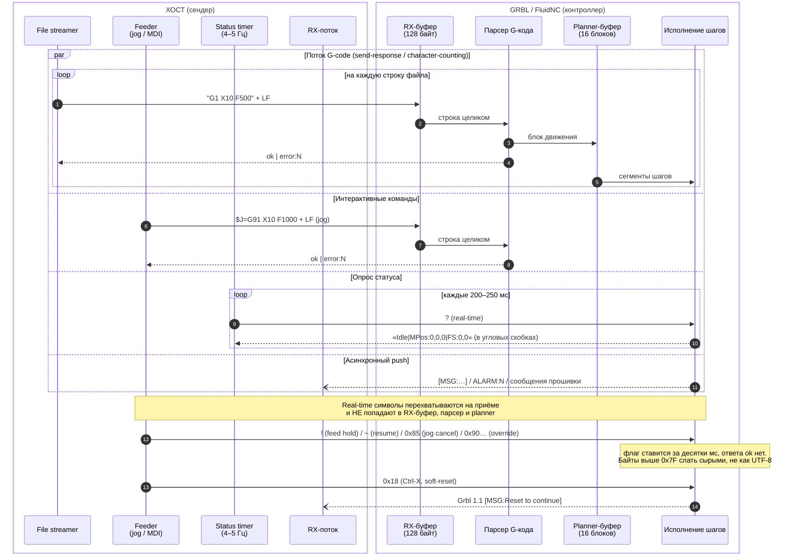

# Архитектурные паттерны G-code сендеров для GRBL и FluidNC: подробный технический обзор

## TL;DR
- Все зрелые GRBL/FluidNC-сендеры строятся вокруг одной и той же базовой модели: асинхронный поток чтения из транспорта (serial/telnet/websocket) + очередь исходящих команд с потоковым протоколом «character-counting» (учёт заполнения RX-буфера GRBL — «up to 128 characters», при 16 planner-блоках) либо более простого «simple send-response», плюс конечный автомат состояний, синхронизируемый по периодическому статус-отчёту `?`.
- Ключевое архитектурное разделение — «обычные» команды (строки, завершаемые LF, порождающие `ok`/`error:` и участвующие в потоковом протоколе) и «real-time» символы (`?`, `~`, `!`, `0x18`, `0x85`, override-байты `0x90..0xA2`), которые перехватываются прошивкой немедленно, не попадают в RX-буфер и не участвуют в счёте символов; правильный сендер отправляет их в обход очереди.
- FluidNC сохраняет GRBL-совместимый протокол, но добавляет сетевые каналы (Telnet:23, WebSocket:81), пофайловый запуск с самого контроллера (`$SD/Run=`, `$LocalFS/Run=`), автоматическую отчётность (`$Report/Interval=`) и мультиканальность; grblHAL добавляет расширенный статус (`0x87`), новые real-time-байты и требует иной последовательности подключения (native USB/сеть не допускают hard-reset).

## Key Findings

1. **Протокол GRBL двухуровневый.** Строковые команды (`G1 X10`, `$$`, `$H`) завершаются CR/LF и всегда получают ответ `ok` или `error:N`. Real-time-команды — одиночные байты, обрабатываемые в момент приёма, минуя RX-буфер. Это фундамент, определяющий всю архитектуру сендера.

2. **Два канонических потоковых протокола.** «Simple send-response» (отправил строку → ждёшь `ok`/`error`) — надёжен, прост, но недоиспользует буферы и даёт start-stop на коротких сегментах. «Character-counting» — сендер ведёт счётчик отправленных, но ещё не подтверждённых символов и держит RX-буфер максимально заполненным, не переполняя его. Референсные реализации — `simple_stream.py` и `stream.py` в репозитории gnea/grbl. Документация прямо утверждает: «We have stress-tested this character-counting protocol to extremes and it has not yet failed. Seemingly, only the speed of the serial connection is the limit».

3. **Джоггинг в GRBL 1.1 — отдельный класс движений.** Команда `$J=` не меняет модальное состояние парсера, ставится в planner-очередь, отменяется мгновенно real-time-байтом `0x85` (jog cancel) с полной очисткой planner-буфера. Проблема «залипания» джога при непрерывном удержании кнопки — центральная сложность, решаемая техникой коротких инкрементов + jog cancel + watchdog.

4. **Модель потоков во всех зрелых сендерах одинакова:** выделенный поток/таск чтения транспорта, очередь(и) исходящих команд (producer-consumer), отдельный таймер опроса статуса (`?` — не чаще 5 Гц по прямой рекомендации GRBL), парсер строк, event-bus/listener для синхронизации UI.

5. **FluidNC** — надстройка над GRBL-моделью с сетью и файловой системой на контроллере; статус-отчёты GRBL 1.1-совместимы, но добавлено поле `SD:` (процент выполнения) и опциональная автоотчётность.

## Details

### 1. Архитектура взаимодействия хост-программы с контроллером

#### Транспортные уровни

**GRBL (классический, ATmega328/Arduino Uno/Nano):** единственный транспорт — USB-serial через USB-to-UART мост (FTDI, CH340, ATmega16U2). Скорость по умолчанию 115200 baud, 8N1. Особенности USB-моста (пакетная буферизация, микрозадержки) — известный источник проблем со стримингом, о чём прямо предупреждает GRBL-вики.

**FluidNC (ESP32):** множество одновременных каналов:
- USB-serial (обычно 115200).
- Telnet — сырой TCP, порт настраивается `$Telnet/Port` (по умолчанию 23).
- WebSocket — «the WebSocket port number is one more than the HTTP port that is configured with `$HTTP/Port` (default 80, so the WebSocket port default is 81)». Важная оговорка из документации FluidNC: «FluidNC v4.0.0 and v4.0.1 use port 80 for WebSockets (not 81)».
- Bluetooth (serial) — на ESP32 с BT; поддерживает advanced line editing, в отличие от telnet/websocket.
- HTTP — для файловых операций и запуска заданий.

FluidNC принимает команды по нескольким интерфейсам одновременно; для Telnet допускает несколько параллельных TCP-подключений. Ответы направляются в тот канал, откуда пришла команда; системные сообщения широковещательно рассылаются всем каналам. Документация FluidNC явно рекомендует предпочитать WebSocket поверх TCP/Telnet.

Ключевое требование FluidNC (дословная цитата вики): «Regardless of which interface you are using, you must respect the GRBL protocol. You cannot just send as many commands as you wish at one time; you must inspect the FluidNC (GRBL protocol compatible) responses and use them to determine when the controller is ready to accept more data». Приём обязательно ведётся в отдельном потоке, поскольку нельзя предполагать, что одна команда даст ровно один ответ в предсказуемый момент.

#### Протокол обмена и real-time команды

Три категории сообщений от GRBL (по классификации официальной вики «Grbl v1.1 Interface»):
- **Response messages:** `ok` или `error:N` — ответ на строковую команду.
- **Push messages:** сообщения-«толчки» вне запроса — в скобках `[...]`, в шевронах `<...>` (статус), начинающиеся с `$` (настройки) или `>` (стартовый блок). Не участвуют в потоковом протоколе.
- **Real-time commands:** одиночные управляющие символы.

Полный набор real-time символов GRBL 1.1:
- `?` — запрос статус-отчёта.
- `~` (0x7E) — cycle start / resume.
- `!` (0x21) — feed hold.
- `0x18` (Ctrl-X) — soft-reset.
- `0x84` — safety door.
- `0x85` — jog cancel.
- Feed override: `0x90` (100%), `0x91` (+10%), `0x92` (−10%), `0x93` (+1%), `0x94` (−1%).
- Rapid override: `0x95` (100%), `0x96` (50%), `0x97` (25%).
- Spindle override: `0x99` (100%), `0x9A` (+10%), `0x9B` (−10%), `0x9C` (+1%), `0x9D` (−1%).
- Toggle: `0x9E` (spindle stop), `0xA0` (flood coolant), `0xA1` (mist coolant).

Свойства real-time команд (по документации `commands.md`): исполняются в течение десятков миллисекунд; это одиночный символ; не требуют CR/LF; не являются частью потокового протокола; перехватываются при приёме и никогда не помещаются в буфер; повторные игнорируются до исполнения предыдущего.

Критическая деталь реализации (issue #162): байты >0x7F при отправке как Unicode-строка превращаются в многобайтовые последовательности (например, `\u0085` → `0xC2 0x85`). Поэтому override и jog cancel нужно слать как чистые байты, а не как символы UTF-8 — эта ошибка регулярно ломает jog cancel и в cncjs (0x85 нельзя было передать как аргумент socket.io-команды `gcode`, т.к. это невалидный UTF-8).

**Разница обработки:** обычная строка проходит путь: RX-буфер → парсер → planner-буфер → исполнение, и в конце парсинга/постановки в план порождает `ok`. Real-time символ вызывает немедленную установку флага в прошивке и исполнение без ответа (кроме `?`, дающего `<...>`).

**Диаграмма взаимодействия:**



### 2. Формирование и управление очередью команд

#### Буферы GRBL

- **Serial RX-буфер:** «This briefly stores up to 128 characters of data received from the host PC until Grbl has time to fetch and parse the line of G-code» (v1.1; внутренне увеличен на +1, чтобы 128 означало ровно 128, а не 127 из-за кольцевой реализации; исторически в документации фигурирует 127 как «полезная» ёмкость). Хранит принятые, но ещё не разобранные строки.
- **Look-ahead planner-буфер:** «This buffer stores up to 16 line motions that are acceleration-planned and optimized for step execution» (в статусе `Bf:` репортится 15 доступных для планировщика).
- **TX-буфер:** увеличен с 64 до 90 байт в v1.1 для улучшения статус-отчётов.

#### Simple send-response

Самый надёжный и рекомендуемый для старта. Хост шлёт строку, ждёт `ok`/`error:`, шлёт следующую. Референс — `simple_stream.py`. Минус — кумулятивная задержка: на каждый блок есть лаг связи, и на плотных коротких сегментах с высокой подачей planner-буфер может опустошаться (start-stop motion). Также планировщик всегда работает с частично заполненным буфером, поэтому полная скорость на таких участках недостижима.

#### Character-counting streaming

Референс — `stream.py`. Алгоритм (по исходнику `stream.py`):

```python
RX_BUFFER_SIZE = 128
c_line = []          # список длин отправленных, но не подтверждённых строк
g_count = 0          # счётчик полученных ok/error
l_count = 0
for line in f:
    l_count += 1
    l_block = line.strip()
    c_line.append(len(l_block) + 1)   # +1 за символ перевода строки
    # Пока сумма символов в RX-буфере не оставляет места под новую строку —
    # ждём ответы от grbl и вычёркиваем подтверждённые строки:
    while sum(c_line) >= RX_BUFFER_SIZE - 1 | s.inWaiting():
        out_temp = s.readline().strip()
        if out_temp.find('ok') < 0 and out_temp.find('error') < 0:
            pass                      # push-сообщение — не считаем
        else:
            g_count += 1
            del c_line[0]             # освобождаем место, соответствующее исполненной строке
    s.write(l_block + '\n')           # отправляем блок
```

Суть: хост держит бегущую сумму символов «в полёте», отнимая длину строки при каждом `ok`/`error`. Это держит RX-буфер заполненным (максимальная пропускная способность, критично для лазеров и растровой гравировки), но никогда не переполняет.

**Оговорки character-counting (из вики и заметок разработчиков):**
- При `error:` GUI должен немедленно остановить стрим, но т.к. буфер уже набит, GRBL продолжит исполнять оставшиеся в буфере строки — нужен soft-reset для гарантированной остановки.
- Нельзя вести character-counting во время записи в EEPROM (`$`-настройки, `$N`, `G10`, `G28.1`): прерывание serial-RX отключается, символы теряются. Такие команды шлют через send-response с ожиданием.
- Периодические `?` пишутся напрямую в порт и НЕ считаются в character-count (они real-time). Ошибка учёта здесь ведёт к переполнению — реальный баг в cncjs (issue #133: статус-запросы на таймере писались в порт мимо счётчика буфера, вызывая «missing words»/«incorrect number format»).

#### Отслеживание ok/error, retry, pause/resume, feed hold

- **ok/error:** каждый `ok` инкрементирует указатель подтверждённых строк и освобождает место; `error:N` — сигнал остановки (для файлового задания).
- **Retry:** канонический GRBL-протокол ретраев на уровне строк не предусматривает — при `error` задание останавливается; надёжность обеспечивается детерминированностью связи. GrblHoming добавлял настраиваемую задержку между символами 0–20 мс из-за опасений потери символов на быстрых ПК.
- **Pause/resume файлового задания:** двухуровневый. «Мягкая» пауза — сендер перестаёт слать новые строки (но GRBL доработает то, что в буферах). «Аппаратная» пауза — real-time `!` (feed hold) с контролируемым торможением, resume — `~`.
- **Переполнение буфера:** если сендер не считает символы и шлёт слишком быстро — GRBL теряет символы/строки, что проявляется как ошибки парсинга «missing word», «bad number format».

#### Реализация в конкретных проектах
- **grbl streaming scripts:** `simple_stream.py` (send-response), `stream.py` (character-counting) — эталон.
- **UGS:** классы `Communicator`/`StreamCommunicator` тянут команды по одной из `GcodeStreamReader`; поддерживают потоковый протокол на уровне backend.
- **cncjs:** класс `Sender` (`src/server/lib/Sender.js`) c двумя протоколами — константы `SP_TYPE_SEND_RESPONSE` и `SP_TYPE_CHAR_COUNTING`; `GrblController` жёстко использует character-counting с буфером 127 (issue #252, #115).
- **ioSender:** опция «Aggressive Buffering» — держать RX-буфер GRBL максимально заполненным (по сути character-counting).
- **FluidNC WebUI / FluidTerm:** соблюдают GRBL-протокол поверх WebSocket; при запуске файла с SD прогресс приходит push-сообщениями через WebSocket.

### 3. Модель состояний и потоков

#### Конечный автомат состояний GRBL

Состояния из статус-отчёта: `Idle`, `Run`, `Hold` (с подсостоянием `Hold:0`/`Hold:1`), `Jog`, `Alarm`, `Door` (`Door:0..3`), `Check`, `Home`, `Sleep`. Переходы:
- `Idle → Run` (получена команда движения / cycle start).
- `Run → Hold` (feed hold `!`), `Hold → Run` (`~`).
- `Idle/Jog → Jog` (`$J=`), `Jog → Idle` (jog cancel `0x85` / завершение).
- любое `→ Alarm` (hard/soft limit, сбой homing), `Alarm → Idle` только через `$X` (unlock) или `$H` (homing).
- `Idle ↔ Check` (`$C`).

#### Опрос статуса

Сендер шлёт `?` на отдельном таймере. Прямая рекомендация GRBL-вики: «We recommend querying Grbl for a `?` real-time status report at no more than 5Hz. 10Hz may be possible, but at some point, there are diminishing returns and you are taxing Grbl's CPU more». На практике проекты используют 4–5 Гц (200–250 мс). cncjs, по данным анализа исходников, использует периодический `queryTimer`, пишущий `?` напрямую в порт (GrblController.js, ~строки 319/324), а также отдельный таймер `$G` (parser state). FluidNC умеет заменить polling автоотчётностью (`$Report/Interval=N` мс).

#### Парсинг статус-отчёта

Формат: `<State|MPos:x,y,z|FS:f,s|WCO:x,y,z|Ov:f,r,s|Bf:15,128|Ln:99999|Pn:XYZ|A:SFM>`. Поля:
- `MPos:`/`WPos:` — машинные/рабочие координаты (что именно — задаётся маской `$10`).
- `FS:` — feed и spindle (или `F:` если шпиндель не репортится).
- `WCO:` — рабочее смещение (интермиттентно, раз в 10–30 отчётов или при изменении).
- `Ov:` — текущие override feed/rapid/spindle.
- `Bf:15,128` — доступные блоки planner-буфера и доступные байты RX-буфера (в v1.1 — «доступно», а не «занято»).
- `Ln:` — номер исполняемой строки (если включены line numbers).
- `Pn:` — сработавшие пины (limit/probe/door), репортятся только «сработавшие».
- FluidNC добавляет `SD:45.5` — процент выполнения файла с SD (по прочитанным байтам).

Парсинг: split по `|`, затем каждый токен по `:`. Тонкость (issue #342): `Bf`, `FS`, `Ov` — исключения, содержат несколько значений в фиксированном порядке; `State` — не key-value, а первый токен. Парсер должен быть устойчив: не полагаться на порядок, игнорировать неизвестные теги (особенно для grblHAL-расширений).

#### Синхронизация UI

Все зрелые сендеры используют event-driven архитектуру: поток чтения → парсер → события/listeners → обновление модели → UI. UGS: Model-View-Presenter, серия Listener-классов транслирует serial-события снизу вверх. cncjs: EventEmitter, события `sender:status`, `feeder:status`, `workflow:state`, `Grbl:state`. Candle: Qt-сигналы/слоты + таймер статуса.

### 4. Режим джойстика/jogging

#### Механика `$J=`

`$J=` — специальное движение (GRBL 1.1). Структура: первые три символа `$J=`, далее как `G1`; обязательны оси и `F` (не модальна — нужна каждый раз). Опционально `G20/G21`, `G90/G91`, `G53` — действуют только на эту команду, не меняя состояние парсера. Каждый `$J=` возвращает `ok` при постановке в план; несколько джогов могут стоять в очереди planner. Джог принимается только в состоянии `Idle` или `Jog`. Смешивать с обычным G-кодом нельзя (lockout error). При включённых soft-limits выход за предел даёт `error`, не alarm.

#### Jog cancel (0x85)

`0x85` делает feed hold текущего джога и очищает planner-буфер от всех джогов, возврат в `Idle` без soft-reset. Не советуют отменять джог через feed hold `!` (может «подвесить» GRBL, если прислан после возврата в Idle).

#### Проблема накопления очереди — центральная сложность

Если при удержании кнопки слать длинные/многочисленные `$J=`, они забивают RX-буфер и planner. Тогда (документированные баги):
- RX-буфер переполняется — GRBL перестаёт обрабатывать что-либо, даже перевод строки. Джеймс Стэнли в своих заметках (incoherency.co.uk, 2024-01-19) формулирует так: «If you send too many commands then the input buffer fills up and Grbl won't process anything else at all! Even if the input buffer contains newline characters and you stop stuffing more into it».
- Jog cancel «не срабатывает»: если cancel послан до прихода `ok` на последний джог, есть «in-flight» команда в `mc_line()`, которая исполнится после очистки, вызывая доп. движение (issue #95, #837). Решение из #837: слать cancel только после `ok`.
- «Runaway»: после отпускания стика движение продолжается, пока буфер не опустеет; в UGS джог мог «залипать» в состоянии Jog (issue #2487, #1494).

#### Continuous jog vs incremental jog

**Incremental jog:** одна кнопка = один фиксированный шаг (`$J=G91 X1 F1000`). Просто, безопасно, нет проблемы очереди.

**Continuous jog:** пока кнопка/стик активны — держим planner заполненным короткими инкрементами. Рекомендованная GRBL методика (jogging.md/вики):
1. Цикл чтения джойстика → вектор движения.
2. Слать короткий `G91`-инкремент с подачей по отклонению стика.
3. Ждать `ok` перед следующей итерацией.
4. Держать planner заполненным, но минимальным.
5. При возврате в нейтраль — послать `0x85` (jog cancel), НЕ feed hold.

#### Расчёт длины инкремента (формулы из GRBL jogging.md)

- `s = v · dt` — длина инкремента; `v` — подача в мм/с, `dt` — оценка времени исполнения одной команды.
- Ограничение по времени: «`dt > 10ms` — The time it takes Grbl to parse and plan one jog command and receive the next one. Depending on a lot of factors, this can be around 1 to 5 ms. To be conservative, `10ms` is used».
- Ограничение по достижимости подачи: `dt > v²/(2·a·(N−1))`, где `N=15` (число planner-блоков), `a` — минимальное ускорение по задействованным осям.
- `T = dt · N` — полная латентность. По документации: «most CNC machines will operate with a jogging time increment of `0.025 sec < dt < 0.06 sec`, which translates to about a `0.4` to `0.9` second total latency when traveling at the max jog rate».
- Смысл: минимизировать суммарную дистанцию в planner для низкой латентности, но так, чтобы заданная подача достигалась. GRBL всегда планирует до полной остановки в конце очереди (безопасность при разрыве связи).

Латентность зависит от ускорения: на машине с низким `a` и высокой подачей торможение до остановки может занять секунды — это не баг, а физика.

**Синхронизация после cancel:** GRBL не даёт feedback о завершении real-time команды. Рекомендация из документации: после `0x85` прекратить стрим и послать `G4P0` — он исполнится сразу после завершения cancel и вернёт `ok`, дав точку синхронизации с минимальной латентностью. Альтернатива — отслеживать переход `Jog → Idle` в статус-отчёте.

#### Watchdog/keepalive и потеря связи

Т.к. GRBL планирует до остановки в конце planner-очереди, при разрыве связи машина безопасно тормозит в конце уже принятых джогов — это встроенная защита. Дополнительно предлагается (issue #2487) safety-timer: при каждом старте джога взводить таймер, который убьёт джог, если ни возврат стика, ни новая команда не пришли — защита от «залипания» continuous jog в UI.

#### Реализации
- **UGS:** continuous jog реализован очередью джогов с фиксированным интервалом + jog cancel при отпускании (issue #745); проблема баланса заполнения planner-буфера и «залипания» — известная (issue #2487, #1494). Проблема: framework горячих клавиш шлёт только keypressed без keyreleased, поэтому continuous jog по клавишам «залипал».
- **cncjs:** команда `jogCancel` шлёт `0x85` (PR #512 colincross); тонкость — если в feeder-очереди ещё есть неотправленный `$J=`, cancel уйдёт раньше него и рассинхронизируется. Рекомендуют слать комментарий `(jog cancel)` после cancel и делать `feeder.reset()`.
- **gSender:** single-button handling incremental/continuous jogging с XY-диагоналями и пресетами.
- **Candle/G-Pilot:** форк G-Pilot добавляет joystick/joypad-поддержку.

### 5. Режим отправки из файла

#### Предпарсинг и визуализация

- **UGS:** файл предобрабатывается на уровне BackendAPI классом `GcodeStreamWriter` — сериализует метаданные в файл фиксированного формата; при стриминге `GcodeStreamReader` вытягивает команды по одной. Это даёт фиксированное потребление памяти — файлы любого размера. Визуализация парсит G-код в `LineSegment` через `GcodeViewParse`/`toObjFromReader`.
- **Обработка комментариев:** удаляются/нормализуются до отправки (в `stream.py` закомментирован вариант `re.sub('\s|\(.*?\)','',line)`, strip пробелов, uppercase). GRBL сам умеет отбрасывать комментарии и пробелы в jog-командах.
- **Прогресс:** по номеру строки / проценту отправленных байтов. FluidNC при запуске с SD добавляет `SD:%` в статус.

#### M0/M1/M6 и паузы

- **M0** — безусловная пауза программы; GRBL входит в `Hold`, resume — `~` (cycle start). 
- **M1** — опциональная пауза.
- **M6** — смена инструмента. Классический GRBL M6 не реализует аппаратно; сендер перехватывает M6 в потоке и ставит задание на паузу, ожидая действия пользователя (issue #172 в UGS). gSender даёт 6 вариантов обработки M6, включая wizard и «passthrough» M6/T контроллеру.
- Тонкость (cnczone): замена `G01 Z` на `M0` в GRBL приводила к «перепрыгиванию» строк при resume в старых версиях — паузы лучше делать через M0, а не через `!`, для детерминизма.

#### Восстановление после ошибки и «run from line»

- При `error:` — стоп; при character-counting нужен soft-reset для очистки набитого буфера.
- **Run from line** (старт с середины файла) требует восстановления модального контекста: сендер должен «проиграть» модальные состояния (единицы G20/G21, плоскость G17-19, режим G90/G91, активная система координат G54-59, последняя подача F, состояние шпинделя/охлаждения M3/M4/M5/M7/M8/M9) до целевой строки, а затем безопасно подвести инструмент. Без этого возможен crash из-за неверного Z или неверных единиц.
- FluidNC при запуске файла с контроллера: любая gcode-ошибка в SD-файле завершает задание, репортится номер строки; понятие «Job Leader» — канал, начавший задание командой `$SD/Run=`, получает ошибки; при ошибке задание «abort» вместе с вложенными файлами/макросами.

### 6. Сравнение реальных open-source реализаций

**Universal Gcode Sender (Java).** Model-View-Presenter. `BackendAPI`/`GUIBackend` — вся backend-логика (соединение, стриминг, firmware-нюансы). Абстракция контроллера: интерфейс `IController` + реализации под GRBL/grblHAL/Smoothieware/TinyG/g2core. Слои: `Connection` (транспорт) → `Communicator` (потоковый протокол, тянет из `GcodeStreamReader`) → `Controller` (firmware-специфика) → listeners → Model → Presenter → View. Event-driven через Listener-классы. Фиксированная память за счёт `GcodeStreamWriter`/`GcodeStreamReader`. Паттерны: layered architecture, observer, producer-consumer, controller abstraction.

**bCNC (Python).** Абстракция контроллера в каталоге `controllers/` (`_GenericController.py`, GRBL0/GRBL1, Smoothie, TinyG). Ядро `Sender.py` — отдельный поток `serialIO()` для чтения/записи serial, парсинг через `mcontrol.parseLine()`. Работает на слабом железе (Raspberry Pi). Auto-leveling через модификацию G-кода на лету. Форки: OKKCNC.

**cncjs (Node.js).** Event-driven на EventEmitter. Ключевое разделение: `Sender` (`src/server/lib/Sender.js`) — потоковая отправка файла (протоколы `SP_TYPE_SEND_RESPONSE`/`SP_TYPE_CHAR_COUNTING`); `Feeder` (`src/server/lib/Feeder.js`) — очередь немедленных/интерактивных команд (jog, MDI, макросы); `Workflow` (`src/server/lib/Workflow.js`) — FSM с состояниями `idle`/`running`/`paused`. `GrblController` (`src/server/controllers/Grbl/GrblController.js`) связывает: serialport-соединение, `GrblRunner` (агрегатор состояния) + `GrblLineParser` (построчный парсер с `GrblLineParserResult*`-классами: статус `<...>`, `ok`, `error`, `$G`, `$$`), `Sender`+`Feeder`+`Workflow`, а также `queryTimer`, пишущий `?` напрямую в порт. Feeder может встать в hold на M0/M6. События `sender:status` (`sp,hold,holdReason,name,context,size,total,sent,received,startTime,finishTime,elapsedTime,remainingTime`) и `feeder:status` (`hold,holdReason,queue,pending,changed`). Клиент — React, связь через socket.io. Поддержка Grbl/Marlin/Smoothie/TinyG. Паттерны: event bus, producer-consumer (Sender/Feeder), FSM (Workflow), controller abstraction.

**Candle (Qt/C++).** `Denvi/Candle` — оригинал. Отдельный поток serial, таймер статуса, Qt-сигналы. Визуализатор траектории на OpenGL. Форки: Candle2 (Schildkroet, + GRBL-Advanced), G-Pilot (etet100, Qt6, + joystick, + uCNC/grblHAL virtual modes). Ориентирован строго на GRBL (в форках — grblHAL/uCNC).

**gSender (Electron).** Изначально форк архитектуры cncjs, затем в основном переписан. Grbl + grblHAL, imperial/metric. Continuous/incremental single-button jogging, probing wizards, firmware flashing, инструменты выравнивания. Обработка M6 с wizards. Автодетект firmware при подключении.

**ioSender (C#/WPF, Windows).** Терье Ио (автор grblHAL). Grbl + grblHAL. Транспорты: serial (`COM74:115200,N,8,1`) и network/telnet (`10.0.0.70:23`). «Aggressive Buffering» = character-counting для заполнения RX. Настройки сгруппированы по функциям (не по `$`-номерам), с чекбоксами вместо битовых полей. Отключает автоотчётность grblHAL при подключении. Поддержка до 9 осей, канонических циклов, режима токарки. `--force legacy Grbl mode` если билд-дата ≥ 20200716 ошибочно детектится как grblHAL. Есть touch-форк ioSenderTouch.

**grblHAL sender / «For sender developers».** grblHAL — 32-битный форк с расширениями. Отличия для сендеров: (1) при native USB/сети hard-reset невозможен (разорвёт соединение) → нельзя полагаться на welcome-сообщение при подключении; (2) startup-последовательность: ждать 400–500 мс, слушать трафик; если приходит real-time report — активен вторичный сендер (MPG), ждать освобождения (`|MPG:0`); (3) запросить расширенный статус `0x87`, определить возможности через `$I+`; (4) новый real-time `0x19` (stop, без warm-reset); (5) alarm-подсостояния (`Alarm:1`); коды 1,2,10 — locked state (E-stop), отвечает только на report-запросы; (6) парсинг должен игнорировать неизвестные теги/значения и не полагаться на порядок.

**FluidNC WebUI.** ESP3D-WEBUI-based, работает в браузере. Использует WebSocket для интерактивного канала и push-сообщений (прогресс задания), HTTP — для файлов и части команд. Может запускать файл прямо с контроллера (`$SD/Run=`).

### 7. Специфика FluidNC vs классический GRBL

- **Сеть:** Telnet:23, WebSocket:81 (или 80 в v4.0.0/4.0.1), одновременная мультиканальность, несколько TCP-клиентов. WiFi (STA/AP), mDNS (`fluidnc.local`), SSDP.
- **WebSocket-протокол:** приём — в отдельном потоке (одна команда ≠ один ответ); real-time символы (`?`) без терминатора, строковые команды с `\n`. WebUI как референс JS-реализации (ESP3D-WEBUI).
- **Файловая система на контроллере:** SD-карта (Arduino SD lib, ≤4 ГБ, littlefs/spiffs для LocalFS). Запуск с контроллера: `$SD/Run=file.nc`, `$LocalFS/Run=file.nc`. «Job Leader» — канал-инициатор получает ошибки. Вложенное исполнение файлов/макросов (`&`-разделитель, `$macros/run=`). Загрузка файлов через HTTP/WebUI или FTP.
- **Отчёты статуса:** GRBL 1.1-совместимы (сознательно, ради совместимости сендеров), но добавлено `SD:%` при задании с SD и опциональная автоотчётность `$Report/Interval=N` (по каналам независимо; при простое — при изменении значения, при движении — с заданным интервалом; по умолчанию выключено ради совместимости). `Bf:15,128` — доступные planner-блоки (задаётся в конфиге) и байты RX. `Ln:` — при `use_line_numbers: true`.
- **Команды/настройки `$`:** формат `$` как у GRBL, но иерархические имена (`$Gcode/Mode` == `$G`, `$/axes/x`), полный список — `$CMD`. Все стандартные GRBL `$`-команды поддержаны. `$Start/Message` — подстройка welcome-строки под сендеры, ожидающие точный формат `Grbl 1.1g ['$' for help]`. Настройки — из YAML-конфига (`config.yaml`), не из EEPROM.
- **Стабильность:** известны случаи зависания/перезагрузки ESP32 при запуске больших файлов с SD (issues #901, #1356) — при критичных заданиях безопаснее стримить с хоста.

### 8. Практические рекомендации и подводные камни

- **Latency и USB:** USB-to-UART мосты дают пакетную буферизацию и микрозадержки; ПК не realtime. На плотных коротких сегментах используйте character-counting, иначе planner starvation и start-stop. Для лазеров/растра character-counting обязателен.
- **Потеря символов / EMI:** электрические помехи и дешёвые USB-кабели вызывают порчу данных (LightBurn прямо указывает на «communications corruptions or electrical interference»). Симптомы: `error:` на валидных строках, «missing word», «bad number format». Меры: экранированный кабель, ферритовые кольца, отдельное питание, синхронный режим передачи. GrblHoming добавлял настраиваемую задержку 0–20 мс между символами.
- **Сброс по USB / EMI:** классический GRBL на Arduino делает hard-reset при открытии порта (DTR/RTS) — при подключении контроллер перезапускается. grblHAL по native USB/сети этого не делает.
- **Таймауты:** статус-опрос не чаще 5 Гц; на homing GRBL/grblHAL НЕ отвечает на `?` — DRO «замирает», это нормально. Не считать это зависанием.
- **Порядок обработки ошибок:** при `error`/`ALARM` немедленно останавливать стрим; при character-counting — soft-reset (`0x18`) для очистки буфера. Всегда халтить программу на ошибке.
- **Real-time байты как чистые байты:** override/jog-cancel (>0x7F) слать как байты, не как UTF-8-символы.
- **Безопасное завершение:** для остановки задания — feed hold `!` затем (при необходимости экстренно) soft-reset `0x18`; учитывать, что soft-reset в движении бросает alarm (позиция потеряна). Для смены инструмента/tool-length используйте `G4P0` как точку синхронизации опустошения буфера.
- **Unlock/homing:** после подачи питания/alarm — `$X` (unlock) или `$H` (homing). Рекомендуется всегда делать `$H` после включения/unlock для точной позиции. Из alarm команды движения заблокированы. `$C` — проверка G-кода без движения (по завершении делает soft-reset, что сбрасывает G92 — предупредить пользователя).
- **EEPROM-команды:** не слать через character-counting (`$`-настройки, `$N`, `G10 L2/L20`, `G28.1`, `G30.1`) — при записи в EEPROM RX-прерывание отключено, символы теряются; слать через send-response с ожиданием `ok`.
- **Startup-последовательность grblHAL:** не полагаться на welcome-сообщение; ждать 400–500 мс, определять MPG-режим (`|MPG:0`), запрашивать `0x87`/`$I+`.

## Recommendations

**Если вы пишете новый сендер (поэтапный подход):**
1. **Начните с simple send-response** (`simple_stream.py` как образец) — отправка строки, ожидание `ok`/`error`. Отдельный поток чтения + очередь исходящих. Это даст работающий надёжный базис за минимум усилий. Порог перехода дальше: если наблюдаете start-stop на плотном G-коде или нужен лазер/растр.
2. **Добавьте character-counting** (`stream.py` как образец) с корректным учётом: считайте только строки (не real-time), держите `?`-опрос вне счётчика, при `error`/`ALARM` делайте soft-reset. Порог: как только базовый стриминг стабилен.
3. **Разделите очереди** по модели cncjs: `Sender` для файла + `Feeder` для интерактивных команд + `Workflow`-FSM. Real-time-команды — всегда в обход очередей, чистыми байтами.
4. **Статус-автомат:** таймер `?` на 4–5 Гц, устойчивый парсер (`|`→`:`, игнор неизвестных тегов), синхронизация UI через события/observer. Для FluidNC рассмотрите `$Report/Interval=`.
5. **Джоггинг:** для MVP — incremental jog. Для continuous — короткие `G91`-инкременты по формуле `s=v·dt` (`0.025<dt<0.06`), `ok`-синхронизация, `0x85`+`G4P0` при отпускании, safety-timer watchdog против «залипания».

**Если вы выбираете готовый сендер:**
- **Новичок, GRBL/grblHAL:** gSender (современный UI, wizards) или UGS (максимально надёжен, кроссплатформенный).
- **grblHAL, Windows, максимум функций:** ioSender (автор — мейнтейнер grblHAL).
- **Сетевой/headless/несколько машин:** cncjs (браузер, Raspberry Pi).
- **Power-user, PCB, auto-leveling:** bCNC.
- **Лёгкий GRBL-контроллер с визуализатором:** Candle/форки.
- **FluidNC с сетью:** WebUI (встроен) для базовых задач + любой GRBL-сендер по WebSocket/Telnet.

**Бенчмарки/пороги смены решения:**
- Если появляются `error` на заведомо валидном G-коде → проблема связи (кабель/EMI), а не сендера: экранирование, синхронный режим, задержка символов.
- Если planner starvation (Bf стабильно высок, движение рвётся) → переход на character-counting или aggressive buffering.
- Если continuous jog «залипает» → внедрить `ok`-синхронизацию + safety-timer + `0x85`-then-`G4P0`.

## Caveats
- **Числовые константы буферов** (128 байт RX, 16/15 planner-блоков) верны для эталонного gnea/grbl v1.1 на ATmega328; на grblHAL/FluidNC/Grbl-Mega они больше и настраиваемы — запрашивайте через `Bf:` в статусе, а не хардкодьте (прямая рекомендация grblHAL и GRBL-вики).
- **Внутренние детали cncjs** (точные значения констант `SP_TYPE_*`, интервал `queryTimer` = 250 мс, имена методов) частично подтверждены косвенно (issues #252, #115, #133) и по конвенциям проекта; их стоит сверить непосредственно в `src/server/lib/Sender.js` и `GrblController.js`.
- **Порт WebSocket FluidNC** зависит от версии (81 по умолчанию; 80 в v4.0.0/4.0.1) — проверяйте под конкретную прошивку.
- Часть материала по джог-багам — из issue-трекеров (баг-репорты, а не спецификация); поведение могло измениться между версиями GRBL/UGS/cncjs.
- Ряд «удобных» сравнительных характеристик сендеров (кому что «рекомендуется») опирается на обзорные статьи и мнения сообщества, а не на формальные бенчмарки.
- FluidNC-стабильность при запуске больших файлов с SD — по отдельным баг-репортам (#901, #1356); не обязательно воспроизводится на всех платах/версиях.# Архитектурные паттерны G-code сендеров для GRBL и FluidNC: подробный технический обзор

## TL;DR
- Все зрелые GRBL/FluidNC-сендеры строятся вокруг одной и той же базовой модели: асинхронный поток чтения из транспорта (serial/telnet/websocket) + очередь исходящих команд с потоковым протоколом «character-counting» (учёт заполнения RX-буфера GRBL — «up to 128 characters», при 16 planner-блоках) либо более простого «simple send-response», плюс конечный автомат состояний, синхронизируемый по периодическому статус-отчёту `?`.
- Ключевое архитектурное разделение — «обычные» команды (строки, завершаемые LF, порождающие `ok`/`error:` и участвующие в потоковом протоколе) и «real-time» символы (`?`, `~`, `!`, `0x18`, `0x85`, override-байты `0x90..0xA2`), которые перехватываются прошивкой немедленно, не попадают в RX-буфер и не участвуют в счёте символов; правильный сендер отправляет их в обход очереди.
- FluidNC сохраняет GRBL-совместимый протокол, но добавляет сетевые каналы (Telnet:23, WebSocket:81), пофайловый запуск с самого контроллера (`$SD/Run=`, `$LocalFS/Run=`), автоматическую отчётность (`$Report/Interval=`) и мультиканальность; grblHAL добавляет расширенный статус (`0x87`), новые real-time-байты и требует иной последовательности подключения (native USB/сеть не допускают hard-reset).

## Key Findings

1. **Протокол GRBL двухуровневый.** Строковые команды (`G1 X10`, `$$`, `$H`) завершаются CR/LF и всегда получают ответ `ok` или `error:N`. Real-time-команды — одиночные байты, обрабатываемые в момент приёма, минуя RX-буфер. Это фундамент, определяющий всю архитектуру сендера.

2. **Два канонических потоковых протокола.** «Simple send-response» (отправил строку → ждёшь `ok`/`error`) — надёжен, прост, но недоиспользует буферы и даёт start-stop на коротких сегментах. «Character-counting» — сендер ведёт счётчик отправленных, но ещё не подтверждённых символов и держит RX-буфер максимально заполненным, не переполняя его. Референсные реализации — `simple_stream.py` и `stream.py` в репозитории gnea/grbl. Документация прямо утверждает: «We have stress-tested this character-counting protocol to extremes and it has not yet failed. Seemingly, only the speed of the serial connection is the limit».

3. **Джоггинг в GRBL 1.1 — отдельный класс движений.** Команда `$J=` не меняет модальное состояние парсера, ставится в planner-очередь, отменяется мгновенно real-time-байтом `0x85` (jog cancel) с полной очисткой planner-буфера. Проблема «залипания» джога при непрерывном удержании кнопки — центральная сложность, решаемая техникой коротких инкрементов + jog cancel + watchdog.

4. **Модель потоков во всех зрелых сендерах одинакова:** выделенный поток/таск чтения транспорта, очередь(и) исходящих команд (producer-consumer), отдельный таймер опроса статуса (`?` — не чаще 5 Гц по прямой рекомендации GRBL), парсер строк, event-bus/listener для синхронизации UI.

5. **FluidNC** — надстройка над GRBL-моделью с сетью и файловой системой на контроллере; статус-отчёты GRBL 1.1-совместимы, но добавлено поле `SD:` (процент выполнения) и опциональная автоотчётность.

## Details

### 1. Архитектура взаимодействия хост-программы с контроллером

#### Транспортные уровни

**GRBL (классический, ATmega328/Arduino Uno/Nano):** единственный транспорт — USB-serial через USB-to-UART мост (FTDI, CH340, ATmega16U2). Скорость по умолчанию 115200 baud, 8N1. Особенности USB-моста (пакетная буферизация, микрозадержки) — известный источник проблем со стримингом, о чём прямо предупреждает GRBL-вики.

**FluidNC (ESP32):** множество одновременных каналов:
- USB-serial (обычно 115200).
- Telnet — сырой TCP, порт настраивается `$Telnet/Port` (по умолчанию 23).
- WebSocket — «the WebSocket port number is one more than the HTTP port that is configured with `$HTTP/Port` (default 80, so the WebSocket port default is 81)». Важная оговорка из документации FluidNC: «FluidNC v4.0.0 and v4.0.1 use port 80 for WebSockets (not 81)».
- Bluetooth (serial) — на ESP32 с BT; поддерживает advanced line editing, в отличие от telnet/websocket.
- HTTP — для файловых операций и запуска заданий.

FluidNC принимает команды по нескольким интерфейсам одновременно; для Telnet допускает несколько параллельных TCP-подключений. Ответы направляются в тот канал, откуда пришла команда; системные сообщения широковещательно рассылаются всем каналам. Документация FluidNC явно рекомендует предпочитать WebSocket поверх TCP/Telnet.

Ключевое требование FluidNC (дословная цитата вики): «Regardless of which interface you are using, you must respect the GRBL protocol. You cannot just send as many commands as you wish at one time; you must inspect the FluidNC (GRBL protocol compatible) responses and use them to determine when the controller is ready to accept more data». Приём обязательно ведётся в отдельном потоке, поскольку нельзя предполагать, что одна команда даст ровно один ответ в предсказуемый момент.

#### Протокол обмена и real-time команды

Три категории сообщений от GRBL (по классификации официальной вики «Grbl v1.1 Interface»):
- **Response messages:** `ok` или `error:N` — ответ на строковую команду.
- **Push messages:** сообщения-«толчки» вне запроса — в скобках `[...]`, в шевронах `<...>` (статус), начинающиеся с `$` (настройки) или `>` (стартовый блок). Не участвуют в потоковом протоколе.
- **Real-time commands:** одиночные управляющие символы.

Полный набор real-time символов GRBL 1.1:
- `?` — запрос статус-отчёта.
- `~` (0x7E) — cycle start / resume.
- `!` (0x21) — feed hold.
- `0x18` (Ctrl-X) — soft-reset.
- `0x84` — safety door.
- `0x85` — jog cancel.
- Feed override: `0x90` (100%), `0x91` (+10%), `0x92` (−10%), `0x93` (+1%), `0x94` (−1%).
- Rapid override: `0x95` (100%), `0x96` (50%), `0x97` (25%).
- Spindle override: `0x99` (100%), `0x9A` (+10%), `0x9B` (−10%), `0x9C` (+1%), `0x9D` (−1%).
- Toggle: `0x9E` (spindle stop), `0xA0` (flood coolant), `0xA1` (mist coolant).

Свойства real-time команд (по документации `commands.md`): исполняются в течение десятков миллисекунд; это одиночный символ; не требуют CR/LF; не являются частью потокового протокола; перехватываются при приёме и никогда не помещаются в буфер; повторные игнорируются до исполнения предыдущего.

Критическая деталь реализации (issue #162): байты >0x7F при отправке как Unicode-строка превращаются в многобайтовые последовательности (например, `\u0085` → `0xC2 0x85`). Поэтому override и jog cancel нужно слать как чистые байты, а не как символы UTF-8 — эта ошибка регулярно ломает jog cancel и в cncjs (0x85 нельзя было передать как аргумент socket.io-команды `gcode`, т.к. это невалидный UTF-8).

**Разница обработки:** обычная строка проходит путь: RX-буфер → парсер → planner-буфер → исполнение, и в конце парсинга/постановки в план порождает `ok`. Real-time символ вызывает немедленную установку флага в прошивке и исполнение без ответа (кроме `?`, дающего `<...>`).

**Диаграмма взаимодействия:**


### 2. Формирование и управление очередью команд

#### Буферы GRBL

- **Serial RX-буфер:** «This briefly stores up to 128 characters of data received from the host PC until Grbl has time to fetch and parse the line of G-code» (v1.1; внутренне увеличен на +1, чтобы 128 означало ровно 128, а не 127 из-за кольцевой реализации; исторически в документации фигурирует 127 как «полезная» ёмкость). Хранит принятые, но ещё не разобранные строки.
- **Look-ahead planner-буфер:** «This buffer stores up to 16 line motions that are acceleration-planned and optimized for step execution» (в статусе `Bf:` репортится 15 доступных для планировщика).
- **TX-буфер:** увеличен с 64 до 90 байт в v1.1 для улучшения статус-отчётов.

#### Simple send-response

Самый надёжный и рекомендуемый для старта. Хост шлёт строку, ждёт `ok`/`error:`, шлёт следующую. Референс — `simple_stream.py`. Минус — кумулятивная задержка: на каждый блок есть лаг связи, и на плотных коротких сегментах с высокой подачей planner-буфер может опустошаться (start-stop motion). Также планировщик всегда работает с частично заполненным буфером, поэтому полная скорость на таких участках недостижима.

#### Character-counting streaming

Референс — `stream.py`. Алгоритм (по исходнику `stream.py`):

```python
RX_BUFFER_SIZE = 128
c_line = []          # список длин отправленных, но не подтверждённых строк
g_count = 0          # счётчик полученных ok/error
l_count = 0
for line in f:
    l_count += 1
    l_block = line.strip()
    c_line.append(len(l_block) + 1)   # +1 за символ перевода строки
    # Пока сумма символов в RX-буфере не оставляет места под новую строку —
    # ждём ответы от grbl и вычёркиваем подтверждённые строки:
    while sum(c_line) >= RX_BUFFER_SIZE - 1 | s.inWaiting():
        out_temp = s.readline().strip()
        if out_temp.find('ok') < 0 and out_temp.find('error') < 0:
            pass                      # push-сообщение — не считаем
        else:
            g_count += 1
            del c_line[0]             # освобождаем место, соответствующее исполненной строке
    s.write(l_block + '\n')           # отправляем блок
```

Суть: хост держит бегущую сумму символов «в полёте», отнимая длину строки при каждом `ok`/`error`. Это держит RX-буфер заполненным (максимальная пропускная способность, критично для лазеров и растровой гравировки), но никогда не переполняет.

**Оговорки character-counting (из вики и заметок разработчиков):**
- При `error:` GUI должен немедленно остановить стрим, но т.к. буфер уже набит, GRBL продолжит исполнять оставшиеся в буфере строки — нужен soft-reset для гарантированной остановки.
- Нельзя вести character-counting во время записи в EEPROM (`$`-настройки, `$N`, `G10`, `G28.1`): прерывание serial-RX отключается, символы теряются. Такие команды шлют через send-response с ожиданием.
- Периодические `?` пишутся напрямую в порт и НЕ считаются в character-count (они real-time). Ошибка учёта здесь ведёт к переполнению — реальный баг в cncjs (issue #133: статус-запросы на таймере писались в порт мимо счётчика буфера, вызывая «missing words»/«incorrect number format»).

#### Отслеживание ok/error, retry, pause/resume, feed hold

- **ok/error:** каждый `ok` инкрементирует указатель подтверждённых строк и освобождает место; `error:N` — сигнал остановки (для файлового задания).
- **Retry:** канонический GRBL-протокол ретраев на уровне строк не предусматривает — при `error` задание останавливается; надёжность обеспечивается детерминированностью связи. GrblHoming добавлял настраиваемую задержку между символами 0–20 мс из-за опасений потери символов на быстрых ПК.
- **Pause/resume файлового задания:** двухуровневый. «Мягкая» пауза — сендер перестаёт слать новые строки (но GRBL доработает то, что в буферах). «Аппаратная» пауза — real-time `!` (feed hold) с контролируемым торможением, resume — `~`.
- **Переполнение буфера:** если сендер не считает символы и шлёт слишком быстро — GRBL теряет символы/строки, что проявляется как ошибки парсинга «missing word», «bad number format».

#### Реализация в конкретных проектах
- **grbl streaming scripts:** `simple_stream.py` (send-response), `stream.py` (character-counting) — эталон.
- **UGS:** классы `Communicator`/`StreamCommunicator` тянут команды по одной из `GcodeStreamReader`; поддерживают потоковый протокол на уровне backend.
- **cncjs:** класс `Sender` (`src/server/lib/Sender.js`) c двумя протоколами — константы `SP_TYPE_SEND_RESPONSE` и `SP_TYPE_CHAR_COUNTING`; `GrblController` жёстко использует character-counting с буфером 127 (issue #252, #115).
- **ioSender:** опция «Aggressive Buffering» — держать RX-буфер GRBL максимально заполненным (по сути character-counting).
- **FluidNC WebUI / FluidTerm:** соблюдают GRBL-протокол поверх WebSocket; при запуске файла с SD прогресс приходит push-сообщениями через WebSocket.

### 3. Модель состояний и потоков

#### Конечный автомат состояний GRBL

Состояния из статус-отчёта: `Idle`, `Run`, `Hold` (с подсостоянием `Hold:0`/`Hold:1`), `Jog`, `Alarm`, `Door` (`Door:0..3`), `Check`, `Home`, `Sleep`. Переходы:
- `Idle → Run` (получена команда движения / cycle start).
- `Run → Hold` (feed hold `!`), `Hold → Run` (`~`).
- `Idle/Jog → Jog` (`$J=`), `Jog → Idle` (jog cancel `0x85` / завершение).
- любое `→ Alarm` (hard/soft limit, сбой homing), `Alarm → Idle` только через `$X` (unlock) или `$H` (homing).
- `Idle ↔ Check` (`$C`).

#### Опрос статуса

Сендер шлёт `?` на отдельном таймере. Прямая рекомендация GRBL-вики: «We recommend querying Grbl for a `?` real-time status report at no more than 5Hz. 10Hz may be possible, but at some point, there are diminishing returns and you are taxing Grbl's CPU more». На практике проекты используют 4–5 Гц (200–250 мс). cncjs, по данным анализа исходников, использует периодический `queryTimer`, пишущий `?` напрямую в порт (GrblController.js, ~строки 319/324), а также отдельный таймер `$G` (parser state). FluidNC умеет заменить polling автоотчётностью (`$Report/Interval=N` мс).

#### Парсинг статус-отчёта

Формат: `<State|MPos:x,y,z|FS:f,s|WCO:x,y,z|Ov:f,r,s|Bf:15,128|Ln:99999|Pn:XYZ|A:SFM>`. Поля:
- `MPos:`/`WPos:` — машинные/рабочие координаты (что именно — задаётся маской `$10`).
- `FS:` — feed и spindle (или `F:` если шпиндель не репортится).
- `WCO:` — рабочее смещение (интермиттентно, раз в 10–30 отчётов или при изменении).
- `Ov:` — текущие override feed/rapid/spindle.
- `Bf:15,128` — доступные блоки planner-буфера и доступные байты RX-буфера (в v1.1 — «доступно», а не «занято»).
- `Ln:` — номер исполняемой строки (если включены line numbers).
- `Pn:` — сработавшие пины (limit/probe/door), репортятся только «сработавшие».
- FluidNC добавляет `SD:45.5` — процент выполнения файла с SD (по прочитанным байтам).

Парсинг: split по `|`, затем каждый токен по `:`. Тонкость (issue #342): `Bf`, `FS`, `Ov` — исключения, содержат несколько значений в фиксированном порядке; `State` — не key-value, а первый токен. Парсер должен быть устойчив: не полагаться на порядок, игнорировать неизвестные теги (особенно для grblHAL-расширений).

#### Синхронизация UI

Все зрелые сендеры используют event-driven архитектуру: поток чтения → парсер → события/listeners → обновление модели → UI. UGS: Model-View-Presenter, серия Listener-классов транслирует serial-события снизу вверх. cncjs: EventEmitter, события `sender:status`, `feeder:status`, `workflow:state`, `Grbl:state`. Candle: Qt-сигналы/слоты + таймер статуса.

### 4. Режим джойстика/jogging

#### Механика `$J=`

`$J=` — специальное движение (GRBL 1.1). Структура: первые три символа `$J=`, далее как `G1`; обязательны оси и `F` (не модальна — нужна каждый раз). Опционально `G20/G21`, `G90/G91`, `G53` — действуют только на эту команду, не меняя состояние парсера. Каждый `$J=` возвращает `ok` при постановке в план; несколько джогов могут стоять в очереди planner. Джог принимается только в состоянии `Idle` или `Jog`. Смешивать с обычным G-кодом нельзя (lockout error). При включённых soft-limits выход за предел даёт `error`, не alarm.

#### Jog cancel (0x85)

`0x85` делает feed hold текущего джога и очищает planner-буфер от всех джогов, возврат в `Idle` без soft-reset. Не советуют отменять джог через feed hold `!` (может «подвесить» GRBL, если прислан после возврата в Idle).

#### Проблема накопления очереди — центральная сложность

Если при удержании кнопки слать длинные/многочисленные `$J=`, они забивают RX-буфер и planner. Тогда (документированные баги):
- RX-буфер переполняется — GRBL перестаёт обрабатывать что-либо, даже перевод строки. Джеймс Стэнли в своих заметках (incoherency.co.uk, 2024-01-19) формулирует так: «If you send too many commands then the input buffer fills up and Grbl won't process anything else at all! Even if the input buffer contains newline characters and you stop stuffing more into it».
- Jog cancel «не срабатывает»: если cancel послан до прихода `ok` на последний джог, есть «in-flight» команда в `mc_line()`, которая исполнится после очистки, вызывая доп. движение (issue #95, #837). Решение из #837: слать cancel только после `ok`.
- «Runaway»: после отпускания стика движение продолжается, пока буфер не опустеет; в UGS джог мог «залипать» в состоянии Jog (issue #2487, #1494).

#### Continuous jog vs incremental jog

**Incremental jog:** одна кнопка = один фиксированный шаг (`$J=G91 X1 F1000`). Просто, безопасно, нет проблемы очереди.

**Continuous jog:** пока кнопка/стик активны — держим planner заполненным короткими инкрементами. Рекомендованная GRBL методика (jogging.md/вики):
1. Цикл чтения джойстика → вектор движения.
2. Слать короткий `G91`-инкремент с подачей по отклонению стика.
3. Ждать `ok` перед следующей итерацией.
4. Держать planner заполненным, но минимальным.
5. При возврате в нейтраль — послать `0x85` (jog cancel), НЕ feed hold.

#### Расчёт длины инкремента (формулы из GRBL jogging.md)

- `s = v · dt` — длина инкремента; `v` — подача в мм/с, `dt` — оценка времени исполнения одной команды.
- Ограничение по времени: «`dt > 10ms` — The time it takes Grbl to parse and plan one jog command and receive the next one. Depending on a lot of factors, this can be around 1 to 5 ms. To be conservative, `10ms` is used».
- Ограничение по достижимости подачи: `dt > v²/(2·a·(N−1))`, где `N=15` (число planner-блоков), `a` — минимальное ускорение по задействованным осям.
- `T = dt · N` — полная латентность. По документации: «most CNC machines will operate with a jogging time increment of `0.025 sec < dt < 0.06 sec`, which translates to about a `0.4` to `0.9` second total latency when traveling at the max jog rate».
- Смысл: минимизировать суммарную дистанцию в planner для низкой латентности, но так, чтобы заданная подача достигалась. GRBL всегда планирует до полной остановки в конце очереди (безопасность при разрыве связи).

Латентность зависит от ускорения: на машине с низким `a` и высокой подачей торможение до остановки может занять секунды — это не баг, а физика.

**Синхронизация после cancel:** GRBL не даёт feedback о завершении real-time команды. Рекомендация из документации: после `0x85` прекратить стрим и послать `G4P0` — он исполнится сразу после завершения cancel и вернёт `ok`, дав точку синхронизации с минимальной латентностью. Альтернатива — отслеживать переход `Jog → Idle` в статус-отчёте.

#### Watchdog/keepalive и потеря связи

Т.к. GRBL планирует до остановки в конце planner-очереди, при разрыве связи машина безопасно тормозит в конце уже принятых джогов — это встроенная защита. Дополнительно предлагается (issue #2487) safety-timer: при каждом старте джога взводить таймер, который убьёт джог, если ни возврат стика, ни новая команда не пришли — защита от «залипания» continuous jog в UI.

#### Реализации
- **UGS:** continuous jog реализован очередью джогов с фиксированным интервалом + jog cancel при отпускании (issue #745); проблема баланса заполнения planner-буфера и «залипания» — известная (issue #2487, #1494). Проблема: framework горячих клавиш шлёт только keypressed без keyreleased, поэтому continuous jog по клавишам «залипал».
- **cncjs:** команда `jogCancel` шлёт `0x85` (PR #512 colincross); тонкость — если в feeder-очереди ещё есть неотправленный `$J=`, cancel уйдёт раньше него и рассинхронизируется. Рекомендуют слать комментарий `(jog cancel)` после cancel и делать `feeder.reset()`.
- **gSender:** single-button handling incremental/continuous jogging с XY-диагоналями и пресетами.
- **Candle/G-Pilot:** форк G-Pilot добавляет joystick/joypad-поддержку.

### 5. Режим отправки из файла

#### Предпарсинг и визуализация

- **UGS:** файл предобрабатывается на уровне BackendAPI классом `GcodeStreamWriter` — сериализует метаданные в файл фиксированного формата; при стриминге `GcodeStreamReader` вытягивает команды по одной. Это даёт фиксированное потребление памяти — файлы любого размера. Визуализация парсит G-код в `LineSegment` через `GcodeViewParse`/`toObjFromReader`.
- **Обработка комментариев:** удаляются/нормализуются до отправки (в `stream.py` закомментирован вариант `re.sub('\s|\(.*?\)','',line)`, strip пробелов, uppercase). GRBL сам умеет отбрасывать комментарии и пробелы в jog-командах.
- **Прогресс:** по номеру строки / проценту отправленных байтов. FluidNC при запуске с SD добавляет `SD:%` в статус.

#### M0/M1/M6 и паузы

- **M0** — безусловная пауза программы; GRBL входит в `Hold`, resume — `~` (cycle start). 
- **M1** — опциональная пауза.
- **M6** — смена инструмента. Классический GRBL M6 не реализует аппаратно; сендер перехватывает M6 в потоке и ставит задание на паузу, ожидая действия пользователя (issue #172 в UGS). gSender даёт 6 вариантов обработки M6, включая wizard и «passthrough» M6/T контроллеру.
- Тонкость (cnczone): замена `G01 Z` на `M0` в GRBL приводила к «перепрыгиванию» строк при resume в старых версиях — паузы лучше делать через M0, а не через `!`, для детерминизма.

#### Восстановление после ошибки и «run from line»

- При `error:` — стоп; при character-counting нужен soft-reset для очистки набитого буфера.
- **Run from line** (старт с середины файла) требует восстановления модального контекста: сендер должен «проиграть» модальные состояния (единицы G20/G21, плоскость G17-19, режим G90/G91, активная система координат G54-59, последняя подача F, состояние шпинделя/охлаждения M3/M4/M5/M7/M8/M9) до целевой строки, а затем безопасно подвести инструмент. Без этого возможен crash из-за неверного Z или неверных единиц.
- FluidNC при запуске файла с контроллера: любая gcode-ошибка в SD-файле завершает задание, репортится номер строки; понятие «Job Leader» — канал, начавший задание командой `$SD/Run=`, получает ошибки; при ошибке задание «abort» вместе с вложенными файлами/макросами.

### 6. Сравнение реальных open-source реализаций

**Universal Gcode Sender (Java).** Model-View-Presenter. `BackendAPI`/`GUIBackend` — вся backend-логика (соединение, стриминг, firmware-нюансы). Абстракция контроллера: интерфейс `IController` + реализации под GRBL/grblHAL/Smoothieware/TinyG/g2core. Слои: `Connection` (транспорт) → `Communicator` (потоковый протокол, тянет из `GcodeStreamReader`) → `Controller` (firmware-специфика) → listeners → Model → Presenter → View. Event-driven через Listener-классы. Фиксированная память за счёт `GcodeStreamWriter`/`GcodeStreamReader`. Паттерны: layered architecture, observer, producer-consumer, controller abstraction.

**bCNC (Python).** Абстракция контроллера в каталоге `controllers/` (`_GenericController.py`, GRBL0/GRBL1, Smoothie, TinyG). Ядро `Sender.py` — отдельный поток `serialIO()` для чтения/записи serial, парсинг через `mcontrol.parseLine()`. Работает на слабом железе (Raspberry Pi). Auto-leveling через модификацию G-кода на лету. Форки: OKKCNC.

**cncjs (Node.js).** Event-driven на EventEmitter. Ключевое разделение: `Sender` (`src/server/lib/Sender.js`) — потоковая отправка файла (протоколы `SP_TYPE_SEND_RESPONSE`/`SP_TYPE_CHAR_COUNTING`); `Feeder` (`src/server/lib/Feeder.js`) — очередь немедленных/интерактивных команд (jog, MDI, макросы); `Workflow` (`src/server/lib/Workflow.js`) — FSM с состояниями `idle`/`running`/`paused`. `GrblController` (`src/server/controllers/Grbl/GrblController.js`) связывает: serialport-соединение, `GrblRunner` (агрегатор состояния) + `GrblLineParser` (построчный парсер с `GrblLineParserResult*`-классами: статус `<...>`, `ok`, `error`, `$G`, `$$`), `Sender`+`Feeder`+`Workflow`, а также `queryTimer`, пишущий `?` напрямую в порт. Feeder может встать в hold на M0/M6. События `sender:status` (`sp,hold,holdReason,name,context,size,total,sent,received,startTime,finishTime,elapsedTime,remainingTime`) и `feeder:status` (`hold,holdReason,queue,pending,changed`). Клиент — React, связь через socket.io. Поддержка Grbl/Marlin/Smoothie/TinyG. Паттерны: event bus, producer-consumer (Sender/Feeder), FSM (Workflow), controller abstraction.

**Candle (Qt/C++).** `Denvi/Candle` — оригинал. Отдельный поток serial, таймер статуса, Qt-сигналы. Визуализатор траектории на OpenGL. Форки: Candle2 (Schildkroet, + GRBL-Advanced), G-Pilot (etet100, Qt6, + joystick, + uCNC/grblHAL virtual modes). Ориентирован строго на GRBL (в форках — grblHAL/uCNC).

**gSender (Electron).** Изначально форк архитектуры cncjs, затем в основном переписан. Grbl + grblHAL, imperial/metric. Continuous/incremental single-button jogging, probing wizards, firmware flashing, инструменты выравнивания. Обработка M6 с wizards. Автодетект firmware при подключении.

**ioSender (C#/WPF, Windows).** Терье Ио (автор grblHAL). Grbl + grblHAL. Транспорты: serial (`COM74:115200,N,8,1`) и network/telnet (`10.0.0.70:23`). «Aggressive Buffering» = character-counting для заполнения RX. Настройки сгруппированы по функциям (не по `$`-номерам), с чекбоксами вместо битовых полей. Отключает автоотчётность grblHAL при подключении. Поддержка до 9 осей, канонических циклов, режима токарки. `--force legacy Grbl mode` если билд-дата ≥ 20200716 ошибочно детектится как grblHAL. Есть touch-форк ioSenderTouch.

**grblHAL sender / «For sender developers».** grblHAL — 32-битный форк с расширениями. Отличия для сендеров: (1) при native USB/сети hard-reset невозможен (разорвёт соединение) → нельзя полагаться на welcome-сообщение при подключении; (2) startup-последовательность: ждать 400–500 мс, слушать трафик; если приходит real-time report — активен вторичный сендер (MPG), ждать освобождения (`|MPG:0`); (3) запросить расширенный статус `0x87`, определить возможности через `$I+`; (4) новый real-time `0x19` (stop, без warm-reset); (5) alarm-подсостояния (`Alarm:1`); коды 1,2,10 — locked state (E-stop), отвечает только на report-запросы; (6) парсинг должен игнорировать неизвестные теги/значения и не полагаться на порядок.

**FluidNC WebUI.** ESP3D-WEBUI-based, работает в браузере. Использует WebSocket для интерактивного канала и push-сообщений (прогресс задания), HTTP — для файлов и части команд. Может запускать файл прямо с контроллера (`$SD/Run=`).

### 7. Специфика FluidNC vs классический GRBL

- **Сеть:** Telnet:23, WebSocket:81 (или 80 в v4.0.0/4.0.1), одновременная мультиканальность, несколько TCP-клиентов. WiFi (STA/AP), mDNS (`fluidnc.local`), SSDP.
- **WebSocket-протокол:** приём — в отдельном потоке (одна команда ≠ один ответ); real-time символы (`?`) без терминатора, строковые команды с `\n`. WebUI как референс JS-реализации (ESP3D-WEBUI).
- **Файловая система на контроллере:** SD-карта (Arduino SD lib, ≤4 ГБ, littlefs/spiffs для LocalFS). Запуск с контроллера: `$SD/Run=file.nc`, `$LocalFS/Run=file.nc`. «Job Leader» — канал-инициатор получает ошибки. Вложенное исполнение файлов/макросов (`&`-разделитель, `$macros/run=`). Загрузка файлов через HTTP/WebUI или FTP.
- **Отчёты статуса:** GRBL 1.1-совместимы (сознательно, ради совместимости сендеров), но добавлено `SD:%` при задании с SD и опциональная автоотчётность `$Report/Interval=N` (по каналам независимо; при простое — при изменении значения, при движении — с заданным интервалом; по умолчанию выключено ради совместимости). `Bf:15,128` — доступные planner-блоки (задаётся в конфиге) и байты RX. `Ln:` — при `use_line_numbers: true`.
- **Команды/настройки `$`:** формат `$` как у GRBL, но иерархические имена (`$Gcode/Mode` == `$G`, `$/axes/x`), полный список — `$CMD`. Все стандартные GRBL `$`-команды поддержаны. `$Start/Message` — подстройка welcome-строки под сендеры, ожидающие точный формат `Grbl 1.1g ['$' for help]`. Настройки — из YAML-конфига (`config.yaml`), не из EEPROM.
- **Стабильность:** известны случаи зависания/перезагрузки ESP32 при запуске больших файлов с SD (issues #901, #1356) — при критичных заданиях безопаснее стримить с хоста.

### 8. Практические рекомендации и подводные камни

- **Latency и USB:** USB-to-UART мосты дают пакетную буферизацию и микрозадержки; ПК не realtime. На плотных коротких сегментах используйте character-counting, иначе planner starvation и start-stop. Для лазеров/растра character-counting обязателен.
- **Потеря символов / EMI:** электрические помехи и дешёвые USB-кабели вызывают порчу данных (LightBurn прямо указывает на «communications corruptions or electrical interference»). Симптомы: `error:` на валидных строках, «missing word», «bad number format». Меры: экранированный кабель, ферритовые кольца, отдельное питание, синхронный режим передачи. GrblHoming добавлял настраиваемую задержку 0–20 мс между символами.
- **Сброс по USB / EMI:** классический GRBL на Arduino делает hard-reset при открытии порта (DTR/RTS) — при подключении контроллер перезапускается. grblHAL по native USB/сети этого не делает.
- **Таймауты:** статус-опрос не чаще 5 Гц; на homing GRBL/grblHAL НЕ отвечает на `?` — DRO «замирает», это нормально. Не считать это зависанием.
- **Порядок обработки ошибок:** при `error`/`ALARM` немедленно останавливать стрим; при character-counting — soft-reset (`0x18`) для очистки буфера. Всегда халтить программу на ошибке.
- **Real-time байты как чистые байты:** override/jog-cancel (>0x7F) слать как байты, не как UTF-8-символы.
- **Безопасное завершение:** для остановки задания — feed hold `!` затем (при необходимости экстренно) soft-reset `0x18`; учитывать, что soft-reset в движении бросает alarm (позиция потеряна). Для смены инструмента/tool-length используйте `G4P0` как точку синхронизации опустошения буфера.
- **Unlock/homing:** после подачи питания/alarm — `$X` (unlock) или `$H` (homing). Рекомендуется всегда делать `$H` после включения/unlock для точной позиции. Из alarm команды движения заблокированы. `$C` — проверка G-кода без движения (по завершении делает soft-reset, что сбрасывает G92 — предупредить пользователя).
- **EEPROM-команды:** не слать через character-counting (`$`-настройки, `$N`, `G10 L2/L20`, `G28.1`, `G30.1`) — при записи в EEPROM RX-прерывание отключено, символы теряются; слать через send-response с ожиданием `ok`.
- **Startup-последовательность grblHAL:** не полагаться на welcome-сообщение; ждать 400–500 мс, определять MPG-режим (`|MPG:0`), запрашивать `0x87`/`$I+`.

## Recommendations

**Если вы пишете новый сендер (поэтапный подход):**
1. **Начните с simple send-response** (`simple_stream.py` как образец) — отправка строки, ожидание `ok`/`error`. Отдельный поток чтения + очередь исходящих. Это даст работающий надёжный базис за минимум усилий. Порог перехода дальше: если наблюдаете start-stop на плотном G-коде или нужен лазер/растр.
2. **Добавьте character-counting** (`stream.py` как образец) с корректным учётом: считайте только строки (не real-time), держите `?`-опрос вне счётчика, при `error`/`ALARM` делайте soft-reset. Порог: как только базовый стриминг стабилен.
3. **Разделите очереди** по модели cncjs: `Sender` для файла + `Feeder` для интерактивных команд + `Workflow`-FSM. Real-time-команды — всегда в обход очередей, чистыми байтами.
4. **Статус-автомат:** таймер `?` на 4–5 Гц, устойчивый парсер (`|`→`:`, игнор неизвестных тегов), синхронизация UI через события/observer. Для FluidNC рассмотрите `$Report/Interval=`.
5. **Джоггинг:** для MVP — incremental jog. Для continuous — короткие `G91`-инкременты по формуле `s=v·dt` (`0.025<dt<0.06`), `ok`-синхронизация, `0x85`+`G4P0` при отпускании, safety-timer watchdog против «залипания».

**Если вы выбираете готовый сендер:**
- **Новичок, GRBL/grblHAL:** gSender (современный UI, wizards) или UGS (максимально надёжен, кроссплатформенный).
- **grblHAL, Windows, максимум функций:** ioSender (автор — мейнтейнер grblHAL).
- **Сетевой/headless/несколько машин:** cncjs (браузер, Raspberry Pi).
- **Power-user, PCB, auto-leveling:** bCNC.
- **Лёгкий GRBL-контроллер с визуализатором:** Candle/форки.
- **FluidNC с сетью:** WebUI (встроен) для базовых задач + любой GRBL-сендер по WebSocket/Telnet.

**Бенчмарки/пороги смены решения:**
- Если появляются `error` на заведомо валидном G-коде → проблема связи (кабель/EMI), а не сендера: экранирование, синхронный режим, задержка символов.
- Если planner starvation (Bf стабильно высок, движение рвётся) → переход на character-counting или aggressive buffering.
- Если continuous jog «залипает» → внедрить `ok`-синхронизацию + safety-timer + `0x85`-then-`G4P0`.

## Caveats
- **Числовые константы буферов** (128 байт RX, 16/15 planner-блоков) верны для эталонного gnea/grbl v1.1 на ATmega328; на grblHAL/FluidNC/Grbl-Mega они больше и настраиваемы — запрашивайте через `Bf:` в статусе, а не хардкодьте (прямая рекомендация grblHAL и GRBL-вики).
- **Внутренние детали cncjs** (точные значения констант `SP_TYPE_*`, интервал `queryTimer` = 250 мс, имена методов) частично подтверждены косвенно (issues #252, #115, #133) и по конвенциям проекта; их стоит сверить непосредственно в `src/server/lib/Sender.js` и `GrblController.js`.
- **Порт WebSocket FluidNC** зависит от версии (81 по умолчанию; 80 в v4.0.0/4.0.1) — проверяйте под конкретную прошивку.
- Часть материала по джог-багам — из issue-трекеров (баг-репорты, а не спецификация); поведение могло измениться между версиями GRBL/UGS/cncjs.
- Ряд «удобных» сравнительных характеристик сендеров (кому что «рекомендуется») опирается на обзорные статьи и мнения сообщества, а не на формальные бенчмарки.
- FluidNC-стабильность при запуске больших файлов с SD — по отдельным баг-репортам (#901, #1356); не обязательно воспроизводится на всех платах/версиях.