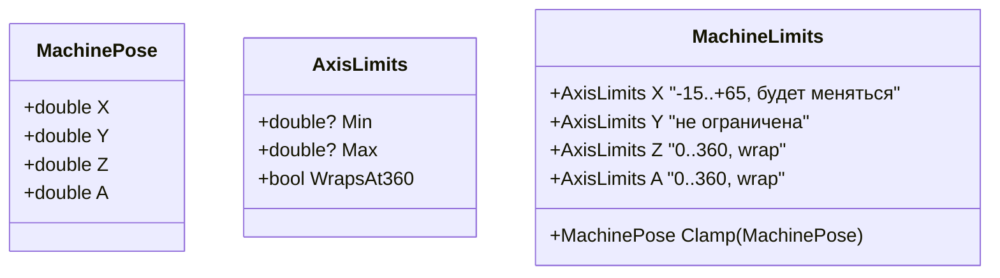
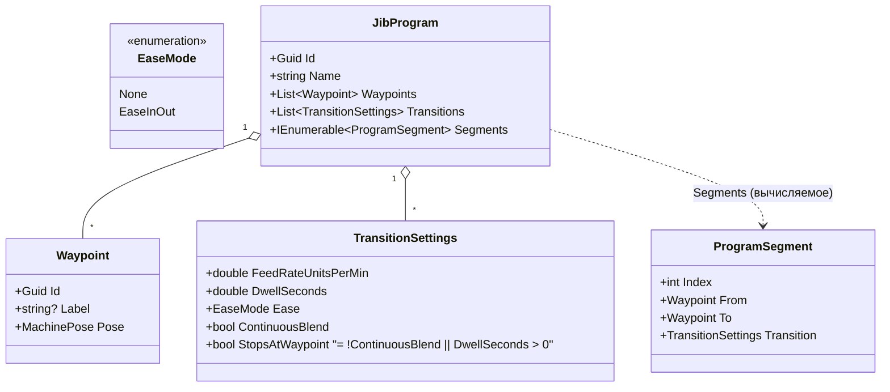
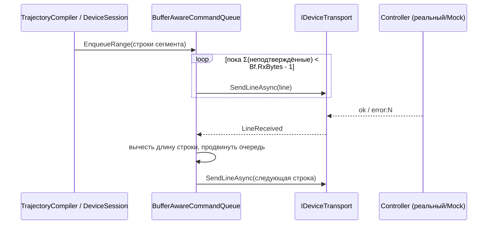
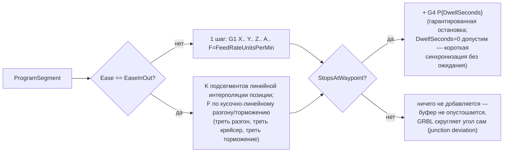
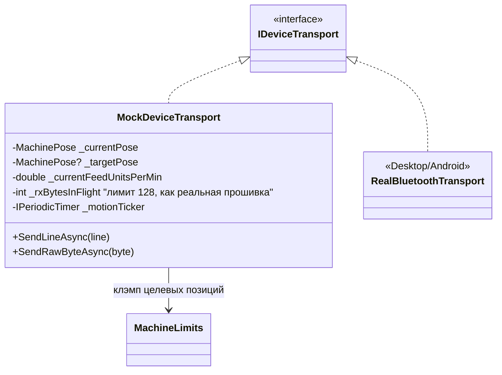
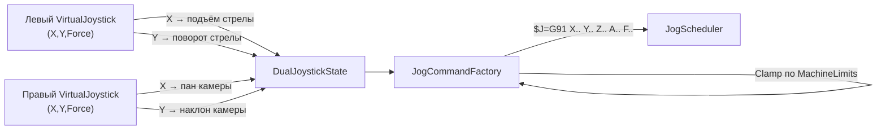
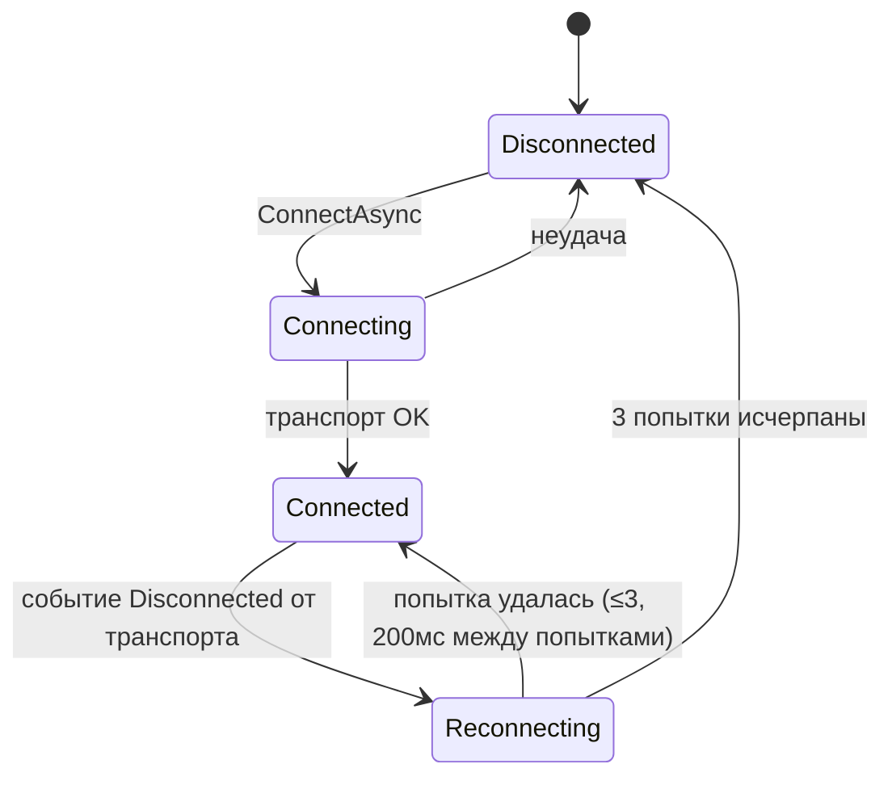
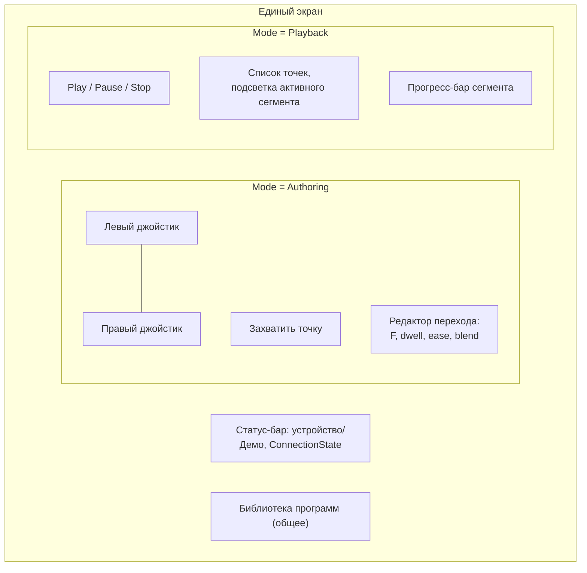

# Архитектура ArctZ: программы ключевых точек, буферизированная передача, демо-режим

## Назначение

Документ [`2026-07-23-arctz-app-architecture-design.md`](2026-07-23-arctz-app-architecture-design.md)
спроектировал базовый слой связи с FluidNC (модель команд, транспорт,
простую ack-очередь, jog, статус, `DeviceSession`) — на момент написания
этого документа он ещё не реализован в коде (есть только сам файл спеки и
план `docs/superpowers/plans/2026-07-23-arctz-device-control-architecture.md`).

Этот документ расширяет тот дизайн под требования, которые не были в
скоупе 23-го числа:

1. Учёт размера буфера контроллера при потоковой передаче (character-counting
   вместо send-one-wait-ok).
2. Демо-режим — не тестовый дублёр, а полноценная эмуляция контроллера,
   выбираемая пользователем в UI.
3. Новая предметная область — программы из ключевых точек: запись точки
   джойстиком, настройка перехода между точками, выполнение сохранённой
   программы с визуализацией текущего перехода.
4. Механика теперь зафиксирована: 4 оси, два джойстика (см. ниже) — снимает
   открытый вопрос "маппинг осей" из документа 23-го числа.

Протокол устройства по-прежнему берётся как есть из
[`../protocol/bluetooth-gcode-control.md`](../protocol/bluetooth-gcode-control.md)
и исследования [`../protocol/gcode_sender_architecture.md`](../protocol/gcode_sender_architecture.md)
(алгоритм character-counting, поведение `Bf:`, real-time-байты).

## Отличия от документа 2026-07-23 (что переопределяется)

| Было (23.07) | Стало (этот документ) | Почему |
|---|---|---|
| `ICommandQueue`/`CommandQueue` — ack-per-line, следующая строка ждёт `ok` | `IBufferAwareCommandQueue`/`BufferAwareCommandQueue` — character-counting по `Bf:` из статус-отчёта | Явное требование "учёт буфера"; ack-per-line даёт рывки на плотных сегментах программы |
| `JoystickState(X, Y, Force)` — один джойстик, 2 условные оси | `DualJoystickState(Left, Right)`, 4 именованные оси X/Y/Z/A | Механика зафиксирована: 2 физических джойстика, 4 степени свободы |
| `FakeDeviceTransport` — только тестовый дублёр | Плюс `MockDeviceTransport` — рабочая реализация `IDeviceTransport`, выбираемая в UI как "Демо" | Требование демо-режима как пользовательской фичи, не только для тестов |
| Открытый вопрос "маппинг осей джойстика" | Закрыт: лев. джойстик → X (подъём стрелы) / Y (поворот стрелы), прав. джойстик → Z (пан камеры) / A (наклон камеры) | Механика спроектирована (см. ниже) |
| Открытый вопрос "нужен ли учёт `Bf:`" | Закрыт: да, обязателен | См. пункт 1 выше |

Всё остальное из документа 23.07 (`IDeviceTransport`, `ICommandSerializer`,
`IRealtimeCommandChannel`, `IJogScheduler`, `IStatusPoller`,
`FluidNcStatusParser`, `IReconnectPolicy`, DI через
`Microsoft.Extensions.DependencyInjection`, `ArctZ.Tests`) остаётся в силе
без изменений и переиспользуется.

## Область (scope)

**В скоупе:**
- `ArctZ/Services/Device/*` — замена `CommandQueue` на буферизированную,
  расширение `DeviceStatus`/`JoystickState` под 4 оси, `MockDeviceTransport`.
- `ArctZ/Services/Program/*` — новый слой: доменная модель программы,
  компилятор программы в G-code (`ITrajectoryCompiler`), хранилище программ
  (`IProgramStorage`).
- ViewModels/View для единого экрана с двумя режимами (Authoring/Playback).
- Обновление `docs/hardware/mechanics.md` и `docs/protocol/bluetooth-gcode-control.md`
  с зафиксированной механикой осей (эти файлы сейчас помечены "не
  определено"/"открытый вопрос" — фактические данные получены в ходе этого
  брейнштроминга от пользователя, не из внешнего источника).

**Вне скоупа (сознательно не проектируется сейчас):**
- Геометрическая 2D/3D-визуализация конструкции джиба — выбрана абстрактная
  визуализация (список точек + прогресс-бар сегмента); геометрия отложена
  до проектирования кинематики стрелы.
- Полная физическая симуляция (ускорение/торможение) в моке — выбрана
  timed-симуляция (линейная интерполяция позиции по времени/подаче), не
  трапецеидальный профиль скорости.
- UI для редактирования `MachineLimits` — лимиты осей заданы в коде как
  конфигурация по умолчанию, экран настроек не проектируется.
- Хранилище программ для головы `ArctZ.Browser` (WASM не имеет обычной ФС) —
  зафиксировано как открытый вопрос, не блокирует дизайн остальных частей.
- Автоматический fallback в демо-режим на iOS/Browser — демо только по
  ручному выбору пользователя на любой платформе.

## Принятые решения (кратко)

| Вопрос | Решение |
|---|---|
| Настройки перехода между точками | Полный набор: `FeedRateUnitsPerMin`, `DwellSeconds`, `EaseMode` (None/EaseInOut), `ContinuousBlend` |
| Визуализация выполнения | Абстрактная: список точек, подсветка активного сегмента, прогресс-бар (не геометрия) |
| Реалистичность демо-симуляции | Timed-симуляция позиции с теми же правилами буфера, что у реальной прошивки |
| Хранение программ | Библиотека именованных программ, каждая — свой JSON-файл |
| Роль демо-режима | Ручной переключатель на всех платформах, не auto-fallback |
| Оси механики | 4 фиксированные: X (подъём стрелы, -15°..+65°, будет уточняться), Y (поворот стрелы, не ограничен), Z (пан камеры, 0..360°, wrap), A (наклон камеры, 0..360°, wrap) |
| Маппинг джойстиков | Левый: X/Y → подъём/поворот стрелы. Правый: X/Y → пан/наклон камеры |
| Редактирование точки | Захват текущей позиции + последующее ручное числовое редактирование |
| Обрыв связи во время Playback | Reconnect-политика: 3 попытки, 200 мс между попытками; при неудаче — пауза выполнения + явная ошибка с указанием сегмента, повторный старт только вручную |
| Навигация UI | Один экран, один `Mode: Authoring \| Playback`, часть контролов общая (статус-бар, список точек) |

## Домен: оси и лимиты



`MachineLimits` — класс с значениями по умолчанию в коде (не файл
конфигурации в MVP; вынести в редактируемые настройки — будущая задача,
явно вне скоупа). `Clamp` применяется в двух местах: `JogCommandFactory`
(до отправки `$J=`) и редактор точки в Authoring-режиме (при ручном вводе
координат) — одна и та же логика, не дублируется.

`DeviceStatus` (существующий тип из 23.07) расширяется полем `double APos`
рядом с `WPosX/WPosY/WPosZ`; `FluidNcStatusParser` учится читать 4-е
значение `WPos:` там, где оно присутствует.

Все 4 оси угловые (градусы), не линейные — в отличие от типового
GRBL/FluidNC-сетапа для ЧПУ-станка. GRBL это не мешает: `$axes`-калибровка
в `config.yaml` (steps/unit) определяется под конкретную ось независимо от
того, линейная она или роторная, значения `WPos`/`G1`-координаты и `F`
(feed) везде остаются "в калиброванных единицах оси" — здесь это градусы.
Поэтому `TransitionSettings.FeedRateUnitsPerMin` намеренно без "Mm" в
названии.

## Домен: программа и точки



`Transitions.Count == Waypoints.Count - 1`; `Transitions[i]` — переход из
`Waypoints[i]` в `Waypoints[i+1]`. Точка с индексом 0 не имеет входящего
перехода. `Segments` — вычисляемое свойство (zip Waypoints/Transitions),
не хранится отдельно — устраняет риск рассинхронизации при
добавлении/удалении точки.

`StopsAtWaypoint` — явное правило снятия неоднозначности между
`ContinuousBlend` и `DwellSeconds`: если `DwellSeconds > 0`, сегмент
**всегда** останавливается в точке независимо от `ContinuousBlend`
(пауза физически требует остановки). Редактор перехода в UI должен
отражать это (`ContinuousBlend`-переключатель дизейблится, когда
`DwellSeconds > 0`).

## Буферизированная очередь команд

Заменяет простую ack-очередь из 23.07. Алгоритм — character-counting из
`stream.py` (см. `docs/protocol/gcode_sender_architecture.md`, раздел 2):
хост держит сумму символов отправленных, но не подтверждённых строк, шлёт
новые строки, пока сумма не приближается к ёмкости RX-буфера контроллера,
освобождает место по `ok`/`error`.



Правила, которые должна соблюдать реализация (из исследования, раздел 8):

- Ёмкость буфера **не константа** — берётся из `Bf:rxBytes,plannerBlocks`
  последнего статус-отчёта (`DeviceSession` вызывает
  `UpdateBufferCapacity(rxBytes, plannerBlocks)` при получении
  `StatusReportLine`); до первого отчёта используется дефолт 128/15.
- Строки, начинающиеся с `$` (настройки, `$H`, `$X`, `$N` и т.п.) —
  **исключение из пайплайнинга**: отправляются только когда очередь пуста
  и подтверждённые предыдущие команды получили `ok`, следующая обычная
  команда не отправляется, пока не подтверждена `$`-команда. Причина —
  запись в EEPROM отключает serial-RX прерывание, символы могут теряться
  при параллельной отправке (см. исследование, раздел 8).
- На `error:N` — очередь сбрасывает ещё не отправленные строки текущего
  задания (не весь буфер контроллера — то, что физически уже отправлено,
  контроллер всё равно исполнит) и поднимает событие, аналогичное
  `CommandRejected`; специальную логику soft-reset (`0x18`) в очередь не
  зашиваем — это решение `DeviceSession`/`PlaybackViewModel` (для Playback:
  остановить выполнение и показать ошибку, см. ниже).
- Real-time-байты (`?`, `!`, `~`, `0x85`, overrides) по-прежнему идут через
  `IRealtimeCommandChannel` в обход очереди и счёта символов — без
  изменений от 23.07.

## Компилятор программы в G-code

`ITrajectoryCompiler.Compile(JibProgram) : IReadOnlyList<CompiledStep>`,
где `CompiledStep(int SegmentIndex, IDeviceCommand Command, double
SegmentProgress)` — `SegmentProgress` (0..1) нужен `PlaybackViewModel`,
чтобы показывать прогресс-бар внутри текущего сегмента, не полагаясь на
геометрию.



Ключевая архитектурная связка: "безостановочный" переход (`ContinuousBlend
= true`) не реализуется хостом как кинематика — он получается автоматически
из штатного планировщика GRBL/FluidNC **при условии**, что
`BufferAwareCommandQueue` держит буфер контроллера заполненным (не даёт
ему опустеть между сегментами). Именно поэтому буферизация — не
самостоятельное требование, а необходимое условие для плавных переходов.

`EaseInOut` — host-side эффект (плавно меняющаяся `F` по подсегментам), не
зависит от `$120`-настроек ускорения контроллера — работает одинаково на
реальной прошивке и на `MockDeviceTransport`. Число подсегментов `K` и
доля разгон/крейсер/торможение — константы компилятора (уточняются в
плане реализации, не архитектурное решение).

## Демо-режим: `MockDeviceTransport`

Не тестовый дублёр (`FakeDeviceTransport` остаётся в `ArctZ.Tests`
исключительно для unit-тестов) — реализация `IDeviceTransport` в
`ArctZ/Services/Device/Simulation/`, регистрируется в DI как ещё один
вариант транспорта, выбираемый пользователем в `ConnectionViewModel`
наравне со списком реальных устройств ("Демо" — всегда доступный пункт
списка на любой платформе).



Поведение:
- Принимает те же строки, что и реальная прошивка (`G0/G1/G4/$J=/$H/$X`),
  через тот же путь `SendLineAsync`. Точка синтаксического разбора внутри
  мока — не переиспользует `FluidNcStatusParser` (тот парсит **входящие**
  строки от контроллера, а не исходящие G-code) — отдельный минимальный
  парсер команд под нужды симуляции.
- Симулирует те же ограничения буфера (128 байт RX, 15 planner-блоков),
  ведёт `ok` с небольшой искусственной задержкой пропорционально занятости
  буфера — не мгновенно, чтобы `BufferAwareCommandQueue` реально
  тестировалась под нагрузкой (а не всегда видела пустой буфер).
- Фоновый таймер (~50 мс тик) продвигает `_currentPose` к `_targetPose`
  линейной интерполяцией с учётом `_currentFeedUnitsPerMin`; `State` —
  `Run`, пока `_currentPose != _targetPose`, иначе `Idle`.
- `$H` — мгновенно `_currentPose = MachinePose.Zero`. `$X` снимает `Alarm`.
  `G4 Pn` — держит `Run` n секунд без продвижения позиции, затем `ok`.
  `$J=`-команды двигают `_targetPose` относительно текущей (как обычный
  jog), `0x85` мгновенно останавливает (`_targetPose = _currentPose`).
- Периодически (симулируя `StatusPoller`, реагируя на входящий `?`)
  отдаёт `<State|WPos:x,y,z,a|Bf:15,128|FS:f,0>` — тот же формат, что
  разбирает `FluidNcStatusParser`, включая `Bf:`, чтобы
  `BufferAwareCommandQueue` работала идентично на реальном устройстве и в
  демо.

## Два джойстика → 4 оси



`JoystickState(X, Y, Force)` из 23.07 (один джойстик) заменяется на:

```csharp
public readonly record struct JoystickAxisInput(double X, double Y, double Force);
public readonly record struct DualJoystickState(JoystickAxisInput Left, JoystickAxisInput Right);
```

`JogCommandFactory.Create(DualJoystickState)` считает 4 дельты (по одной
паре осей на джойстик, масштаб — `Force` своего стика) и общий `F` (по
большему из двух `Force`, чтобы одновременное движение двух джойстиков не
тормозило самую "сильную" ось), затем клэмпит результирующую `MachinePose`
по `MachineLimits` **до** сериализации в `$J=` — невалидный `$J=` GRBL
всё равно завернёт в `error`, лучше не отправлять его вовсе.

`MainView` получает второй `VirtualJoystick` (левый/правый), оба
пробрасывают события в `ProgramViewModel` так же, как единственный джойстик
в 23.07 (`OnLeftJoystickMove`/`OnRightJoystickMove` → `IDeviceSession.
UpdateJog(DualJoystickState)`).

## Соединение и обрыв связи во время выполнения программы

Переиспользуется `IReconnectPolicy`/`DeviceSession` из 23.07 (Task 13
плана), конкретизируется политика и её последствия для Playback.



`FixedDelayReconnectPolicy(maxAttempts: 3, delay: 200ms)` — конкретные
параметры вместо абстрактного "policy" из 23.07.

`PlaybackViewModel` подписан на `DeviceSession.ConnectionStateChanged`:
при переходе в `Reconnecting` во время выполнения — ставит воспроизведение
на паузу (не шлёт новые сегменты из `BufferAwareCommandQueue`, но не
считает это отменой) и запоминает `SegmentIndex`/`CompiledStep`, на
котором произошёл обрыв. Если реконнект вернулся в `Connected` — остаётся
на паузе, ждёт явного "Продолжить" от пользователя (не резюмирует
автоматически — неизвестно, в каком состоянии контроллер оказался за время
разрыва). Если ушло в `Disconnected` (все попытки исчерпаны) — выполнение
помечается `Aborted`, UI показывает ошибку с указанием сегмента останова.

## Хранение программ

```csharp
public interface IProgramStorage
{
    Task<IReadOnlyList<ProgramSummary>> ListAsync();
    Task<JibProgram> LoadAsync(Guid id);
    Task SaveAsync(JibProgram program);
    Task DeleteAsync(Guid id);
}
```

`ProgramSummary(Guid Id, string Name, DateTimeOffset ModifiedAt)` — для
списка библиотеки без загрузки всех точек. Реализация — по файлу на
программу (`{id}.json`) в per-platform writable-каталоге:
- Desktop/Android: `Environment.GetFolderPath(SpecialFolder.ApplicationData)/ArctZ/Programs/`.
- iOS: аналогичный sandbox-каталог приложения.
- Browser (WASM): **открытый вопрос** — обычной ФС нет, нужен
  `IndexedDB`/`localStorage`-backed `IProgramStorage`; не блокирует дизайн
  остальных платформ, каждая голова регистрирует свою реализацию в DI
  так же, как сейчас `IDeviceTransport`.

## UI: один экран, два режима



`ProgramViewModel` (расширяет/заменяет `MainViewModel` из 23.07):
- `Mode` (`[ObservableProperty]`, enum `Authoring`/`Playback`) — переключает
  видимость `AuthoringPane`/`PlaybackPane` в XAML через
  `IsVisible="{Binding Mode, Converter=...}"` либо через два
  `DataTemplate`, ключуемых на `Mode` (решается в плане реализации, не
  архитектурно значимо).
- Общее: `Connection` (`ConnectionViewModel`, как в 23.07),
  `CurrentProgram` (`JibProgram`), `Library` (`ObservableCollection<ProgramSummary>`).
- Authoring: `CaptureWaypointCommand` (читает `DeviceSession.DeviceStatus.
  Value.Pose`, добавляет `Waypoint`), `SelectedWaypoint` +
  редактируемые поля `TransitionSettings` для перехода к нему, левый/правый
  джойстик через `IDeviceSession.UpdateJog(DualJoystickState)`.
- Playback: `PlayCommand`/`PauseCommand`/`StopCommand`, `CurrentStep`
  (`CompiledStep?`), `SegmentProgress` (double), делегирует отправку
  `ITrajectoryCompiler.Compile(CurrentProgram)` в `BufferAwareCommandQueue`
  и слушает `CommandCompleted`/`DeviceStatusChanged` для обновления
  `CurrentStep`/`SegmentProgress`.

## Изменения в существующих draft-документах

По итогам этого брейнштроминга механика и протокол больше не "не
определены" — при реализации плана обновить:
- `docs/hardware/mechanics.md` — таблица осей заполняется 4 строками
  (X/Y/Z/A) вместо "не определено".
- `docs/protocol/bluetooth-gcode-control.md` — снять открытый вопрос про
  маппинг осей джойстика (раздел "От джойстика к G-code").

Это документация фактов, а не архитектурное решение — включено сюда, чтобы
план реализации не забыл про синхронизацию черновиков.

## Открытые вопросы (не блокируют реализацию)

- [ ] `IProgramStorage` для `ArctZ.Browser` — `IndexedDB` или иной
      WASM-подход.
- [ ] Точные константы `TrajectoryCompiler` (число подсегментов `K` при
      `EaseInOut`, доли разгон/крейсер/торможение) — подбираются
      экспериментально при реализации, не архитектурны.
- [ ] Нужен ли `$X` всегда после реконнекта (унаследовано из 23.07,
      по-прежнему открыт — требует реального железа).
- [ ] `MachineLimits.X` (диапазон подъёма стрелы) помечен пользователем как
      "будет меняться" — при реализации вынести в один явно
      закомментированный конфиг-объект, чтобы менять без поиска по коду.
