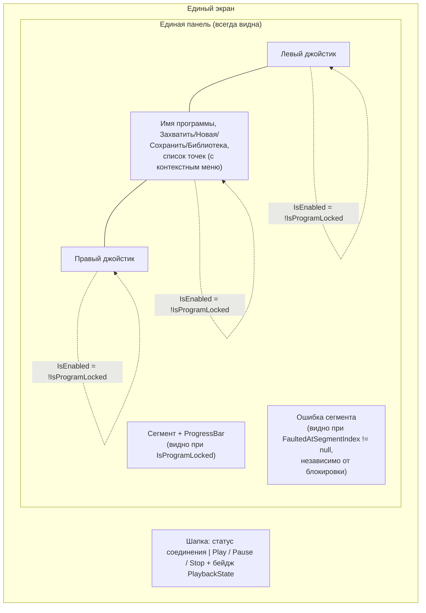

# Объединение режимов записи и выполнения программы

## Назначение

Экран ArctZ сейчас переключается между двумя отдельными панелями —
«ПРОГРАММИРОВАНИЕ» (джойстики + редактируемый список точек) и
«ВЫПОЛНЕНИЕ» (свой список точек + Play/Pause/Stop + прогресс сегмента) —
через `ToggleButton` в шапке, управляющие `ProgramMode`. Это дублирует
список точек в двух местах и требует явного переключения режима вручную.

Документ описывает объединение в один экран: единственная панель с
джойстиками и списком точек всегда видна; блокировка редактирования на
время выполнения программы и отображение прогресса управляются напрямую
существующим `PlaybackState`, без отдельного понятия «режим».

Логика Play/Pause/Stop, машина состояний `PlaybackState`, компилятор
программы и буферизированная очередь команд — уже реализованы и покрыты
тестами (`ProgramViewModelPlaybackTests.cs`); документ их не меняет,
только UI-слой (`MainView.axaml`, `MainView.axaml.cs`,
`ProgramViewModel.cs`).

## Область (scope)

**В скоупе:**
- `ArctZ/Views/MainView.axaml` — шапка (замена переключателей режима на
  Play/Pause/Stop), удаление отдельной Playback-панели, перенос блока
  прогресса/ошибки под список точек единой панели, блокировка
  джойстиков и элементов редактирования по `IsProgramLocked`.
- `ArctZ/Views/MainView.axaml.cs` — удаление обработчиков переключения
  режима, ставших мёртвым кодом.
- `ArctZ/ViewModels/ProgramViewModel.cs` — добавление вычисляемого
  свойства `IsProgramLocked`; удаление `Mode`, `IsAuthoring`,
  `IsPlayback`.
- `ArctZ/ViewModels/ProgramMode.cs` — удаляется (тип становится неиспользуемым).

**Вне скоупа:**
- Любые изменения в `PlaybackState`, `PlayAsync`/`PauseAsync`/`StopAsync`,
  `ITrajectoryCompiler`, `BufferAwareCommandQueue` — переиспользуются как
  есть.
- Подсветка активного сегмента в списке точек — не запрошена, не
  проектируется.
- Библиотека программ (`IsLibraryOpen`, модальный список) — уже
  реализована в незакоммиченной рабочей копии независимо от этой задачи,
  не трогается за исключением того, что кнопка «Библиотека» подпадает
  под общую блокировку редактирования.

## Принятые решения

| Вопрос | Решение |
|---|---|
| Где разместить Play/Pause/Stop | В шапке, на месте прежних переключателей режима «ПРОГРАММИРОВАНИЕ»/«ВЫПОЛНЕНИЕ» |
| Поведение при `PlaybackState.Faulted` | Как Stop: джойстики и редактирование разблокируются автоматически (следствие того, что `Faulted` не входит в блокирующий набор состояний), сообщение об ошибке сегмента остаётся видимым независимо от блокировки |
| Блокировать ли кнопки редактирования (Захватить точку/Новая/Сохранить/Библиотека) и список точек вместе с джойстиками | Да, единым признаком `IsProgramLocked` |
| Что считается «заблокировано» | `PlaybackState` в `Running` или `Paused` |

## UI: один экран, без переключателя режима



### Шапка

Верхний `Grid` меняется с `ColumnDefinitions="*,Auto,Auto"` (статус
соединения + два `ToggleButton`) на `"*,Auto"`: слева статус соединения
как сейчас, справа — горизонтальный `StackPanel` с тремя кнопками
(`PlayCommand`/`PauseCommand`/`StopCommand`, те же `CanExecute`, что уже
реализованы) и бейджем `{Binding PlaybackState}` (перенос текущего
`Border` со статусом из старой Playback-панели без изменений вида).

### Единая панель

Прежняя Authoring-`Border` (джойстики + `StackPanel` с именем/кнопками/
списком точек) теряет `IsVisible="{Binding IsAuthoring}"` — видна
всегда. Playback-`Border` (второй список точек, свои Play/Pause/Stop,
блок прогресса) удаляется целиком — её элементы прогресса/ошибки
переезжают под список точек единой панели (см. ниже), Play/Pause/Stop и
список точек не дублируются.

Средняя колонка панели (сейчас `StackPanel Grid.Column="1"`) делится на
две части:
1. **Блокируемая часть** — `TextBox` с именем программы, ряд кнопок
   «Захватить точку»/«Новая»/«Сохранить»/«Библиотека», список точек
   `KeyPoints` с контекстным меню (Изменить/На точку/Из машины/Удалить).
   Оборачивается в контейнер с `IsEnabled="{Binding !IsProgramLocked}"`.
2. **Блок выполнения**, под списком точек, вне блокируемого контейнера
   (чтобы не выглядел визуально задизейбленным во время воспроизведения):
   - Прогресс (текущий `Grid` «СЕГМЕНТ» + `ProgressBar`) —
     `IsVisible="{Binding IsProgramLocked}"`.
   - Блок ошибки по `FaultedAtSegmentIndex` — видимость как сейчас,
     `Converter={x:Static ObjectConverters.IsNotNull}`, не зависит от
     блокировки.

Оба `VirtualJoystick` в левой/правой колонках панели получают
`IsEnabled="{Binding !IsProgramLocked}"`.

## ViewModel: `ProgramViewModel.cs`

Добавляется:
```csharp
public bool IsProgramLocked => PlaybackState is PlaybackState.Running or PlaybackState.Paused;
```
с `[NotifyPropertyChangedFor(nameof(IsProgramLocked))]` на свойстве
`PlaybackState` (в дополнение к уже существующим
`NotifyCanExecuteChangedFor` для Play/Pause/Stop-команд).

Удаляются: свойство `Mode` (`[ObservableProperty] private ProgramMode
_mode`), вычисляемые `IsAuthoring`/`IsPlayback`.

Логика `OnConnectionPropertyChanged`, `OnSessionConnectionStateChanged`,
`CanPlay`/`CanPause`/`CanStop`, `PlayAsync`/`PauseAsync`/`StopAsync` —
без изменений; блокировка полностью производна от `PlaybackState`,
который эти методы уже поддерживают в актуальном состоянии.

## Удаление мёртвого кода

- `ArctZ/ViewModels/ProgramMode.cs` — файл удаляется (после удаления
  `Mode` из `ProgramViewModel` и `IsVisible`-биндингов в `MainView.axaml`
  тип больше нигде не используется — подтверждено поиском по всей
  кодовой базе, кроме `docs/`, которые не требуют синхронизации для этой
  чисто UI-задачи).
- `ArctZ/Views/MainView.axaml.cs` — удаляются `OnAuthoringModeClicked` и
  `OnPlaybackModeClicked`.

## Тестирование

Существующие тесты `ProgramViewModelPlaybackTests.cs` проверяют
`PlaybackState`/`PlayCommand`/`PauseCommand`/`StopCommand` напрямую через
`ProgramViewModel`, без зависимости от `Mode` — остаются рабочими без
изменений и продолжают быть источником регрессионной защиты для
Play/Pause/Stop-логики.

Ручная проверка после реализации (десктоп-голова): убедиться, что при
`Play` джойстики визуально дизейблятся и появляется прогресс-бар, при
`Pause` джойстики остаются задизейбленными, при `Stop` (и при
`Faulted`, если удастся спровоцировать через демо-транспорт) экран
возвращается к активным джойстикам и полю редактирования, а бейдж в
шапке отражает актуальный `PlaybackState`.
