# Руководство пользователя ArctZ

<!-- Служебное (не для читателя руководства):
     скриншоты лежат в screenshots/ и перегенерируются командой
     dotnet test ArctZ.Tests.Screenshots/ArctZ.Tests.Screenshots.csproj
     При изменении интерфейса обновляйте и скриншоты, и этот документ.
     Экспорт в PDF: docs/export-user-guide-pdf.ps1 -->

**Документ соответствует состоянию приложения на 21.08.2026 (ветка `master`).** Скриншоты сняты с Desktop-сборки в печатной теме; на экране цвета темнее, расположение элементов то же.

ArctZ — приложение для управления камерным джибом: моторизованной стрелой для плавных операторских проездов и панорамирования. Приложение соединяется с контроллером FluidNC и передаёт ему команды G-code.

Что вы можете делать:

- вручную водить стрелой и камерой двумя виртуальными джойстиками;
- записывать последовательность ключевых точек и сохранять её как программу;
- воспроизводить программу — один раз, по кругу или «туда-обратно»;
- следить за состоянием станка и разбирать проблемы связи по журналу отправленных команд.

## Что работает на какой платформе

Экраны на всех платформах выглядят одинаково, но возможности отличаются:

| Платформа | Реальный джиб | Как выбирается устройство | Режим «Демо» | Сохранение программ |
|---|---|---|---|---|
| Desktop (Windows) | да, Bluetooth SPP | Приложение само опрашивает COM-порты и показывает найденные | да | файлы на диске |
| Android | да, Bluetooth SPP | Список спаренных Bluetooth-устройств | да | файлы на диске |
| Браузер | да, через Web Serial | Штатное окно выбора порта самого браузера | да | **только в памяти** — программы пропадают при перезагрузке страницы |
| iOS | **нет** | — | да | файлы на диске |

В браузере приложение обращается к тому же виртуальному COM-порту, который создаёт спаренный по Bluetooth станок, но делает это через Web Serial API — поэтому нужен браузер с его поддержкой (Chrome, Edge; в Firefox и Safari пункт «Устройство» будет отмечен как недоступный).

На iOS реального подключения нет: Bluetooth SPP там недоступен на уровне системы. Работайте в режиме «Демо». Подробнее о причинах — [`docs/protocol/bluetooth-gcode-control.md`](protocol/bluetooth-gcode-control.md).

**На Android** приложение продолжает вести программу, даже если свернуть его: в шторке висит уведомление с названием программы, состоянием и прогрессом, а на нём — кнопки **«Пауза»/«Продолжить»** и **«Стоп»**. Если смахнуть приложение из списка недавних, станок будет остановлен принудительно.

## Содержание

1. [Быстрый старт](#1-быстрый-старт)
2. [Безопасность](#2-безопасность)
3. [Подключение к устройству](#3-подключение-к-устройству)
4. [Главный экран](#4-главный-экран)
5. [Ручное управление и оси станка](#5-ручное-управление-и-оси-станка)
6. [Аварийные ситуации](#6-аварийные-ситуации)
7. [Ключевые точки](#7-ключевые-точки)
8. [Запуск программы](#8-запуск-программы)
9. [Настройки завершения программы](#9-настройки-завершения-программы)
10. [Переименование, сохранение и создание новой программы](#10-переименование-сохранение-и-создание-новой-программы)
11. [Библиотека программ](#11-библиотека-программ)
12. [Боковое меню и навигация](#12-боковое-меню-и-навигация)
13. [Журнал G-code](#13-журнал-g-code)
14. [Демонстрационный режим («Настройки мока»)](#14-демонстрационный-режим-настройки-мока)
15. [О программе и диагностика](#15-о-программе-и-диагностика)
16. [Где хранятся программы](#16-где-хранятся-программы)
17. [Устранение неполадок](#17-устранение-неполадок)
18. [Глоссарий](#18-глоссарий)

---

## 1. Быстрый старт

Первый проезд можно записать за несколько минут — в том числе без станка, в режиме «Демо».

1. Запустите приложение. Откроется окно **«ПОДКЛЮЧЕНИЕ»**.
2. Выберите в списке **«Демо»** (для реального джиба — «Устройство») и нажмите **«Подключить»**. Дождитесь статуса «Подключено» — окно закроется само.
3. Джойстиками внизу экрана приведите стрелу и камеру в первое нужное положение.
4. Нажмите кнопку-прицел **◎ «Захватить»** — в списке «ТОЧКИ» появится «Точка 1».
5. Повторите шаги 3–4 ещё как минимум один раз: проезд получится, только если точек хотя бы две.
6. Откройте меню **⋮** рядом с названием программы → **▣ «Сохранить»**, введите имя и подтвердите.
7. Нажмите **▶ «Пуск»**. Станок сам доедет до первой точки и пойдёт дальше по списку — вставать в неё вручную не нужно (см. [раздел 8](#8-запуск-программы)). Плитка точки, к которой идёт движение, подсвечивается рамкой и показывает кольцо оставшегося времени, а под заголовком «ТОЧКИ» ползёт полоса общего прогресса. По окончании статус в шапке покажет «Завершено».

---

## 2. Безопасность

Приложение управляет механикой, которая двигается сама и с закреплённой на ней камерой. Перед каждым запуском программы:

- убедитесь, что в зоне движения стрелы нет людей, техники и препятствий, и не находитесь в ней сами во время воспроизведения;
- проверьте, что кабели камеры и питания имеют запас длины на всём пути движения и ни за что не зацепятся;
- проверьте балансировку и надёжность крепления камеры — станок стремится уложиться в заданное время перехода независимо от нагрузки;
- держите под рукой кнопку **⏹ «Стоп»**: она немедленно останавливает станок (feed hold). Если этого недостаточно — обесточьте станок.

Помните, что при разрыве связи станок останавливается не мгновенно: контроллер FluidNC успевает отработать уже принятые в буфер команды.

---

## 3. Подключение к устройству

При запуске приложение показывает модальное окно **«ПОДКЛЮЧЕНИЕ»**. Оно перекрывает главный экран, пока связь не установлена.

1. Выберите в списке нужную строку:
   - **реальный джиб** — как он называется в списке, зависит от платформы: на Desktop это найденные COM-порты, на Android — спаренные Bluetooth-устройства, в браузере — одна строка «Устройство», по которой открывается штатное окно выбора порта. Рядом со строкой приложение подписывает, что о ней известно (например, «спарено»);
   - **Демо** — симулятор станка, реального оборудования не требует. Подходит и для знакомства с приложением, и для проверки программ (см. [раздел 14](#14-демонстрационный-режим-настройки-мока)).

   Если реальное подключение на этой платформе невозможно, приложение прямо скажет об этом в окне подключения — например, «Web Serial API не поддерживается этим браузером. Доступен только режим «Демо»».
2. Нажмите **⊘ «Подключить»**.
3. Кружок-индикатор и текст рядом показывают ход подключения: «Не подключено» → «Подключение…» → «Подключено».
4. После успешного подключения окно закрывается автоматически, открывается главный экран.

**Если связь пропала во время работы**, приложение восстанавливает её самостоятельно, а главный экран перекрывается заставкой с индикатором и текстом происходящего:

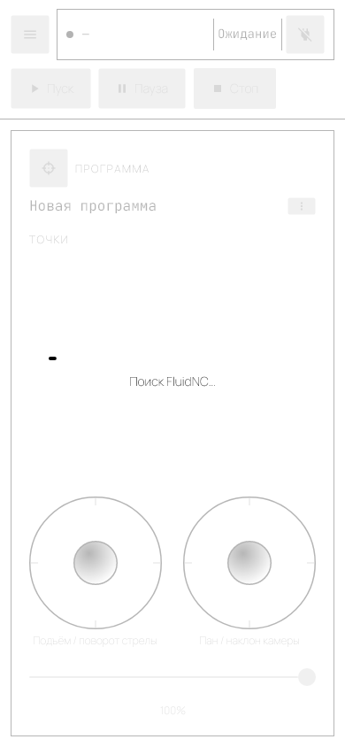

| Текст на заставке | Что происходит |
|---|---|
| «Переподключение…» | Быстрая попытка вернуться на то же самое устройство |
| «Поиск FluidNC…» | Приложение заново ищет станок среди доступных устройств |
| «Попытка N из M не удалась, повтор…» | Пауза перед очередным заходом |

Пока идёт автоматическое восстановление, окно подключения со списком устройств не показывается — оно вернётся, только когда попытки закончатся неудачей. Заставка появляется исключительно после обрыва уже установленной связи: при запуске приложения вы всегда видите обычное окно подключения.

Программа, если она выполнялась, при обрыве связи автоматически встаёт на паузу — см. [раздел 8](#8-запуск-программы).

Отключиться можно в любой момент кнопкой **⊘ питания** в шапке главного экрана (см. [раздел 4](#4-главный-экран)); во время воспроизведения программы она недоступна. После отключения снова открывается окно подключения.

Если станок на момент подключения уже находится в аварии (Alarm), сразу после закрытия окна подключения откроется окно аварии — см. [раздел 6](#6-аварийные-ситуации).

> **Известное ограничение.** Если подключение не удалось, окно просто остаётся в состоянии «Не подключено»: подробная причина ошибки в интерфейсе не показывается. Проверьте питание станка и то, что он спарен и не занят другим подключением; что именно ушло на станок и что он ответил, видно в разделах «Последние ошибки» и «Обмен с устройством» отчёта **ⓘ «О программе»** (см. [раздел 15](#15-о-программе-и-диагностика)).

---

## 4. Главный экран

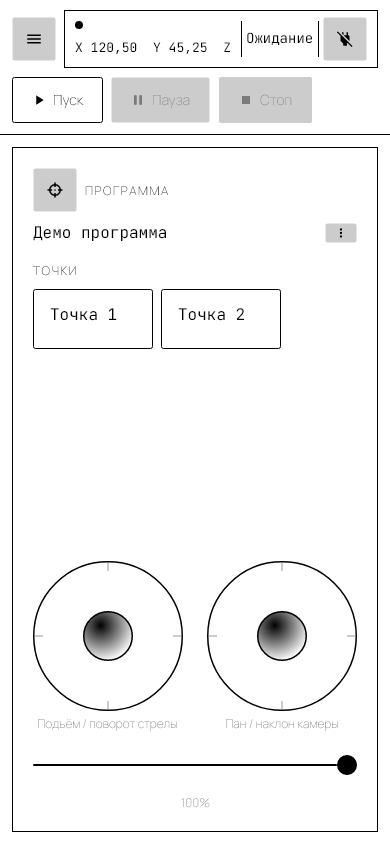

Главный экран состоит из шапки и панели программы.

### Шапка

- **☰** слева — открывает [боковое меню](#12-боковое-меню-и-навигация).
- **Строка статуса** показывает:
  - индикатор соединения и текущие координаты станка (X/Y/Z/A) — координаты появляются только после подключения, до этого стоит прочерк;
  - общий статус станка и программы одним словом;
  - кнопку **⊘** с подсказкой «Отключить» — разрывает соединение (недоступна во время воспроизведения).
- **▶ Пуск / ⏸ Пауза / ⏹ Стоп** — управление воспроизведением, см. [раздел 8](#8-запуск-программы).

Статус в шапке — единый для станка и программы; при совпадении нескольких условий побеждает верхнее в таблице:

| Статус | Что означает |
|---|---|
| **АВАРИЯ** | Контроллер сообщил об аварии. См. [раздел 6](#6-аварийные-ситуации) |
| **Ошибка** | Программа прервана ошибкой. Под списком точек появится сообщение с номером сегмента |
| **Выполнение** | Программа выполняется — либо станок физически ещё движется |
| **Пауза** | Программа приостановлена (кнопкой **⏸** «Пауза» или автоматически из-за потери связи) |
| **Джог** | Станок движется по команде джойстика |
| **Homing** | Станок выполняет поиск нулевых положений (запускается со стороны станка) |
| **Завершено** | Программа отработала до конца |
| **Остановлено** | Программа прервана кнопкой «Стоп» |
| **Удержание** | Станок удерживается в feed hold — обычное состояние после «Стоп» до следующего «Пуск» |
| **Ожидание** | Станок свободен, программа не выполняется |

Статусы «Завершено», «Остановлено» и «Ошибка» через 4 секунды сами сменяются на «Ожидание» — это нормально, ничего не зависло.

### Панель «ПРОГРАММА»

- Кнопка-прицел **◎ «Захватить»** — добавляет ключевую точку с текущим положением станка. Доступна только когда положение известно (станок подключён и прислал статус).
- Название программы и кнопка **⋮** рядом с ним. В меню: **✎ «Переименовать»**, **▭ «Новая»**, **▣ «Сохранить»**, **⚑ «Настройки завершения»**, **▥ «Библиотека»**.
- Список **«ТОЧКИ»** — плитки в порядке выполнения. Нажатие на плитку открывает меню действий над точкой (см. [раздел 7](#7-ключевые-точки)). Плитка точки, к которой станок едет прямо сейчас, обведена акцентной рамкой.
- Два виртуальных джойстика внизу — см. [раздел 5](#5-ручное-управление-и-оси-станка).

Во время воспроизведения (статус «Выполнение» или «Пауза») вся панель «ПРОГРАММА» заблокирована: ни захватить точку, ни отредактировать её, ни подвигать джойстиками нельзя. Нажмите «Стоп» или дождитесь завершения программы.

### Как показан ход программы

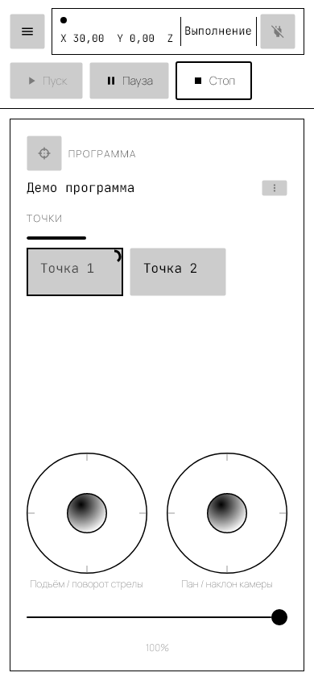

Во время воспроизведения над списком точек появляется полоса общего прогресса, а на плитке текущей точки — ещё два индикатора:

| Индикатор | Где | Что означает |
|---|---|---|
| Полоса | под заголовком «ТОЧКИ» | Какая доля времени всей программы уже прошла. Видна только во время воспроизведения |
| Кольцо | правый верхний угол плитки | Сколько времени осталось до прихода в эту точку: полное кольцо — переход только начался, кольца не осталось — отведённое время вышло |
| **⚠** | левый верхний угол плитки | Переход занял заметно больше времени, чем задано в точке (порог — превышение на 15 %) |

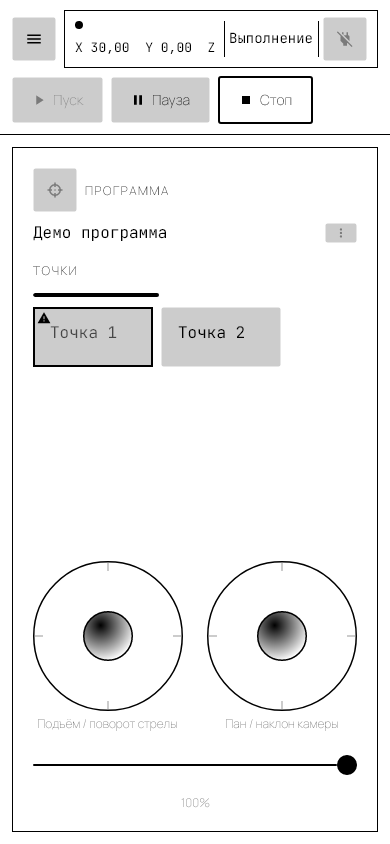

Прогресс считается **по времени, а не по пройденному расстоянию**: приложение сравнивает, сколько времени уже идёт переход, с временем перехода, заданным в точке (см. [раздел 7](#7-ключевые-точки)). Из этого следуют две вещи:

- кольцо и **⚠** никогда не видны одновременно — кольцо истаивает ровно тогда, когда отведённое время кончилось, а предупреждение появляется чуть позже;
- время, проведённое на паузе, в прогресс не засчитывается, в том числе долгий перерыв из-за потери связи.

Какая точка считается текущей, определяется по фактическому положению станка, а не по тому, какие команды уже приняты контроллером: контроллер набирает команды в буфер заранее, и по ним движение выглядело бы завершённым раньше, чем стрела действительно доехала.

Каждое превышение времени попадает в историю сообщений точки (см. [раздел 7](#7-ключевые-точки)) и в журнал выполнения (см. [раздел 15](#15-о-программе-и-диагностика)).

---

## 5. Ручное управление и оси станка

Джойстики работают, пока программа не выполняется. Чем дальше отклонён джойстик, тем выше скорость: приложение шлёт станку команды пошагового перемещения (`$J=`), а сила отклонения задаёт подачу.

| Джойстик | Направление | Ось | Что двигается |
|---|---|---|---|
| Левый | горизонталь | **X** | подъём стрелы |
| Левый | вертикаль | **Y** | поворот стрелы |
| Правый | горизонталь | **Z** | пан камеры |
| Правый | вертикаль | **A** | наклон камеры |

Эти же обозначения X/Y/Z/A вы видите в координатах в шапке и в полях редактора точки.

**Ползунок скорости** под джойстиками (от 5 % до 100 %, текущее значение подписано числом) задаёт общий потолок скорости ручного управления: он одинаково уменьшает и длину шага, и подачу, поэтому на малых значениях стрелой удобно доводить кадр по миллиметру, а на 100 % — быстро переезжать. На воспроизведение программы ползунок не влияет: там скорость определяется временем перехода точки (см. [раздел 7](#7-ключевые-точки)). На узком экране ползунок располагается под джойстиками, на широком — рядом с ними.

**Пределы движения.** Приложение ограничивает ручное управление: X — диапазоном от −15 до 65, Z и A замкнуты по кругу (360 переходит в 0), Y не ограничен. Пределы зашиты в приложении и в этой версии не настраиваются. Обратите внимание: на значения, введённые **вручную** в редакторе точки, эти ограничения не распространяются — такая координата уйдёт на станок как есть.

**Единицы измерения** приложение не преобразует: числа в полях X/Y/Z/A — те же, что показывает контроллер FluidNC согласно его собственной конфигурации (см. [`docs/firmware/fluidnc-setup.md`](firmware/fluidnc-setup.md)).

---

## 6. Аварийные ситуации

Когда контроллер FluidNC сообщает об аварии (Alarm — например, сработал концевой выключатель или потеряна позиция), приложение показывает блокирующее окно **«АВАРИЯ»** с кодом ошибки (например, «Авария FluidNC: код 1»).

1. Устраните физическую причину аварии на станке: упор в концевой выключатель, препятствие на пути движения и т. п.
2. Нажмите **↺ «Сброс аварии»**.
3. Если контроллер принял сброс, окно закрывается и станок возвращается в рабочее состояние.

Пока окно аварии открыто, главный экран недоступен.

Если одновременно потеряна связь, приоритет у окна подключения (см. [раздел 3](#3-подключение-к-устройству)): без связи сброс аварии всё равно не выполнится. После восстановления связи окно аварии откроется снова, если авария ещё активна.

---

## 7. Ключевые точки

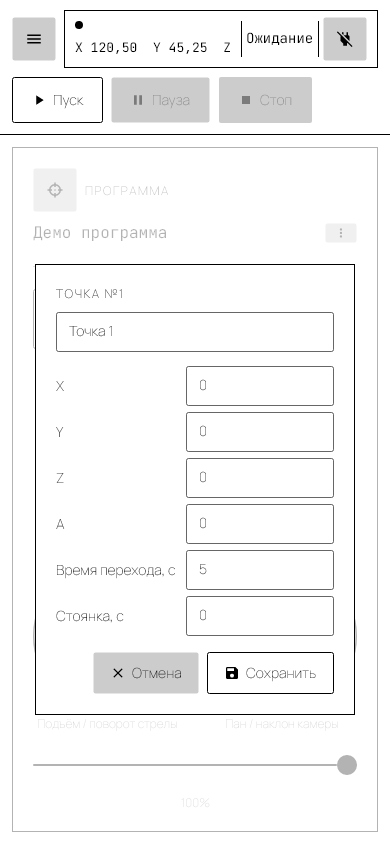

Ключевая точка — это положение стрелы и камеры (координаты X/Y/Z/A) плюс время перехода в него и пауза после прихода. Точки выполняются в том порядке, в каком лежат в списке; номера пересчитываются автоматически при удалении и перемещении.

### Добавление точки

Приведите станок в нужное положение и нажмите кнопку-прицел **◎ «Захватить»**. В конец списка добавится точка с именем «Точка N» и текущими координатами станка. Редактор при этом не открывается — чтобы переименовать точку или поправить координаты, откройте её вручную (см. ниже).

Кнопка неактивна, пока положение станка неизвестно: нет подключения либо контроллер ещё не прислал ни одного статуса.

### Меню точки

Нажатие на плитку открывает меню:

- **⌖ На точку** — отправляет станок прямо в координаты этой точки. Удобно, чтобы проверить, куда точка ведёт, не запуская программу целиком. Требует подключения.
- **✎ Изменить** — открывает редактор точки.
- **⤓ Из машины** — заменяет координаты точки текущим положением станка (имя, время перехода и стоянка сохраняются).
- **⬆ Переместить вверх / ⬇ Переместить вниз** — меняет порядок выполнения.
- **✉ Сообщения** — открывает историю сообщений этой точки (см. ниже).
- **␡ Удалить** — удаляет точку после подтверждения.

### Редактор точки

Окно **«ТОЧКА №N»** содержит:

| Поле | Назначение |
|---|---|
| Название (поле вверху, не более 30 символов) | Подпись на плитке. Длинные названия отображаются шрифтом меньшего размера |
| X, Y, Z, A | Координаты осей (расшифровка осей — в [разделе 5](#5-ручное-управление-и-оси-станка)) |
| Время перехода, с | Сколько секунд занимает движение **в эту точку** из предыдущей. Задаётся вместо скорости: чем меньше время, тем быстрее едет станок. При захвате точке присваивается 5 с |
| Стоянка, с | Пауза в секундах после прихода в точку, перед перемещением к следующей. 0 — без паузы |

**▣ «Сохранить»** применяет изменения (к программе, не к файлу на диске), **✕ «Отмена»** закрывает окно без изменений.

**Про время перехода.** Скорость нигде не задаётся напрямую — станку отправляется длительность каждого отрезка (режим `G93`, см. [раздел 13](#13-журнал-g-code)), а скорость он подбирает сам исходя из расстояния. Поэтому одно и то же значение даёт разную скорость на коротком и на длинном перемещении, а слишком малое время на длинном отрезке станок отработать не сможет — переход затянется, и точка получит предупреждение о перерасходе.

Время перехода первой точки используется дважды: для самого первого хода программы (из текущего положения станка в первую точку) и для возврата в начальную позицию по завершении, если он включён (см. [раздел 9](#9-настройки-завершения-программы)).

> **Плавный разгон и торможение, а также слитные переходы без остановки в точке в интерфейсе пока не настраиваются.** В каждой точке станок останавливается, а внутри перехода скорость постоянна.

### Удаление точки

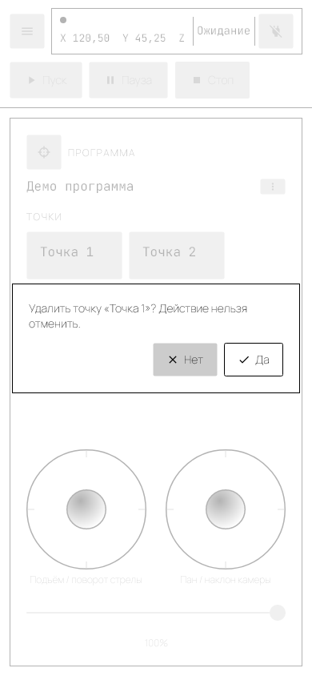

Удаление всегда подтверждается: «Удалить точку «…»? Действие нельзя отменить.» — **✔ «Да»** удаляет, **✕ «Нет»** отменяет.

Редактирование точек и кнопка **◎ «Захватить»** недоступны во время воспроизведения программы.

### История сообщений точки

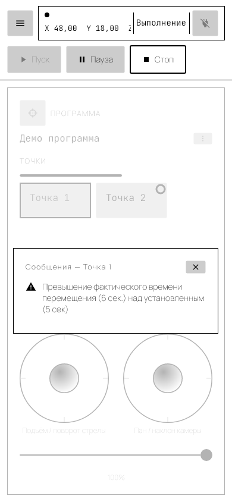

Меню плитки → **✉ «Сообщения»** открывает то, что точка накопила во время воспроизведения. Сейчас сюда попадает один вид сообщений — предупреждение о перерасходе времени: «Превышение фактического времени перемещения (6 сек.) над установленным (5 сек)». Появляется оно тогда же, когда на плитке загорается **⚠** (см. [раздел 4](#4-главный-экран)).

Что с этим делать: увеличить «Время перехода» в этой точке. Перерасход означает, что станок физически не успевает пройти расстояние за отведённый срок, и дальше программа поедет с накопленным отставанием.

Список живёт до конца сеанса работы приложения: он очищается при создании новой программы, загрузке другой программы из библиотеки и удалении самой точки, но переживает остановку и повторный запуск программы. У точки без сообщений окно показывает «Нет сообщений». Окно закрывается кнопкой **✕**.

---

## 8. Запуск программы

Воспроизведением управляют три кнопки в шапке.

- **▶ Пуск** — запускает программу или продолжает её после паузы. Если программа ещё не сохранена или в ней есть несохранённые изменения, сначала появится запрос на сохранение (см. [раздел 10](#10-переименование-сохранение-и-создание-новой-программы)).
- **⏸ Пауза** — доступна только во время выполнения. Останавливает станок (feed hold); продолжить можно кнопкой «Пуск». Время, проведённое на паузе, в прогрессе программы не учитывается.
- **⏹ Стоп** — доступна во время выполнения и на паузе. Прерывает программу. Станок остаётся удерживаемым (статус «Удержание») до следующего «Пуск».

### С какой точки начинается движение

Программа начинается с перемещения **в первую точку**: станок сам доедет до неё из того положения, в котором находится, и только потом пойдёт 1→2, 2→3 и так далее. Вставать в первую точку вручную перед запуском не нужно.

Учтите одну особенность: путь до первой точки станок проходит за время перехода, заданное **в самой первой точке**, каким бы длинным этот путь ни был. Если станок стоит далеко от начала программы, поставьте первой точке время с запасом — иначе первый ход затянется и точка получит предупреждение о перерасходе (см. [раздел 7](#7-ключевые-точки)).

Программа из одной точки тоже выполнима: станок доедет до неё, отстоит «Стоянку» и завершится.

### Если программа прервалась ошибкой

Под списком точек появляется предупреждение вида «Ошибка на сегменте 3 из 7. «Пуск» запустит программу заново с начала», а статус в шапке меняется на «Ошибка». Обратите внимание: после ошибки «Пуск» **не продолжает** программу с места сбоя, а перезапускает её целиком.

### Если пропала связь во время выполнения

- Начало переподключения → программа автоматически переходит в **«Пауза»**.
- Связь окончательно потеряна → статус **«Ошибка»**, программа прервана.
- После восстановления связи программа остаётся на паузе: продолжение — только вашим явным нажатием «Пуск».

---

## 9. Настройки завершения программы

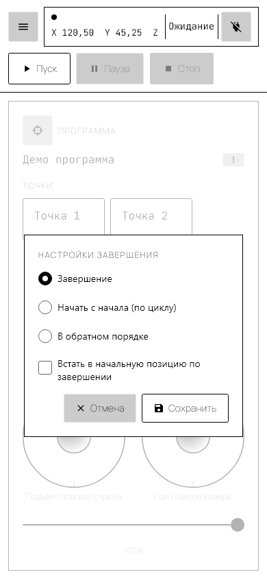

Эти настройки определяют, что станок делает, пройдя все точки. Открываются через меню **⋮** → **⚑ «Настройки завершения»**.

- **Завершение** — программа останавливается после одного прохода.
- **Начать с начала (по циклу)** — станок возвращается в первую точку и повторяет программу.
- **В обратном порядке** — станок идёт по точкам вперёд, затем назад, и так далее (маятник).

Для режимов «Начать с начала» и «В обратном порядке» доступен параметр:

- **Количество повторов** — сколько циклов выполнить. Для маятникового режима один цикл — это пара «туда и обратно». Поле неактивно, если включено **«Неограниченно»**.

Разница между циклическими режимами: в режиме «Начать с начала» между циклами станок отдельно доезжает до первой точки, в маятниковом режиме такого перемещения нет — обратный проход начинается с той точки, где закончился прямой.

Независимо от режима можно включить **«Встать в начальную позицию по завершении»** — тогда после последнего прохода станок дополнительно вернётся в первую точку. Этот возврат считается полноценным дополнительным шагом программы: программа из трёх точек выполняется как 1-2-3-1, и полоса общего прогресса дойдёт до конца только после возврата, а не после третьей точки. Время на возврат берётся из времени перехода первой точки.

Если очередной проход и без того заканчивается в первой точке (циклический режим, маятниковый разворот), приложение не повторяет уже достигнутую точку и сразу переходит к следующему шагу — в журнале выполнения такой пропуск отмечается отдельной строкой.

**▣ «Сохранить»** применяет настройки к программе, **✕ «Отмена»** закрывает окно без изменений. Чтобы сохранить их на диск, воспользуйтесь ⋮ → **▣ «Сохранить»**.

---

## 10. Переименование, сохранение и создание новой программы

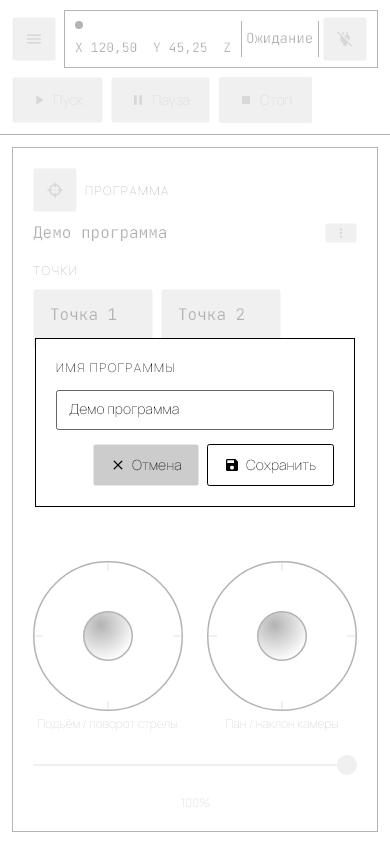

> **Важно про потерю данных.** Приложение **не** спрашивает о несохранённых изменениях, когда вы создаёте новую программу (⋮ → **▭ «Новая»**) или загружаете программу из библиотеки. В обоих случаях текущая программа со всеми правками заменяется немедленно. Сохраняйте программу до таких действий.

Меню **⋮** рядом с названием программы:

- **✎ Переименовать** — открывает окно **«ИМЯ ПРОГРАММЫ»** с текущим именем. Введите новое и нажмите **▣ «Сохранить»** (или **✕ «Отмена»**, чтобы оставить прежнее). Переименование меняет имя только в текущей программе; чтобы записать его на диск, выполните «Сохранить».
- **▭ Новая** — очищает экран: имя сбрасывается на «Новая программа», точки и настройки завершения удаляются. Без предупреждения — см. врезку выше.
- **▣ Сохранить** — записывает программу в библиотеку:
  - при первом сохранении сначала запрашивается имя (тем же окном «ИМЯ ПРОГРАММЫ»);
  - если программа уже сохранялась, запрашивается подтверждение перезаписи: «Сохранить поверх ранее сохранённой программы «…»? Текущие данные на диске будут перезаписаны.»;
  - если в библиотеке уже есть **другая** программа с таким же именем, приложение отдельно предупредит об этом и предложит всё-таки сохранить дубликат под тем же именем.

Сохранение может начаться и само — при нажатии **▶ «Пуск»**: если программа ещё не сохранялась, будет запрошено имя; если есть несохранённые изменения, появится вопрос «В программе «…» есть несохранённые изменения. Сохранить перед запуском?». В обоих случаях можно ответить **✕ «Нет»** — тогда программа не запустится.

---

## 11. Библиотека программ

В библиотеке лежат все сохранённые программы. Открывается через меню **⋮** → **▥ «Библиотека»**.

- В списке видны имя программы, дата создания и дата изменения. Колонка «Изменено» заполняется, только если программа изменялась не в день создания.
- Текущая загруженная программа отмечена цветной полосой слева.
- Нажатие на строку загружает программу — она заменяет текущую на экране (**без** предупреждения о несохранённых изменениях, см. [раздел 10](#10-переименование-сохранение-и-создание-новой-программы)).
- Закрывается кнопка **✕**.

Особенности этой версии: порядок программ в списке не сортируется (как файлы лежат на диске), поиска нет, **удалить программу из библиотеки в приложении нельзя** — удаляйте файл вручную (см. [раздел 16](#16-где-хранятся-программы)).

---

## 12. Боковое меню и навигация

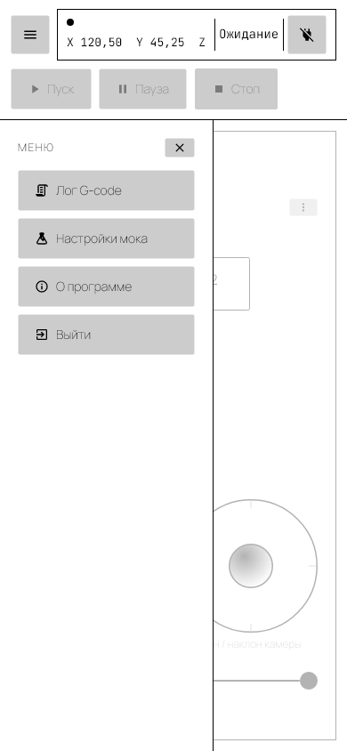

Кнопка **☰** в левом верхнем углу открывает панель **«МЕНЮ»** с четырьмя пунктами:

- **▤ Лог G-code** — см. [раздел 13](#13-журнал-g-code).
- **⚗ Настройки мока** — см. [раздел 14](#14-демонстрационный-режим-настройки-мока).
- **ⓘ О программе** — диагностический отчёт и журнал выполнения, см. [раздел 15](#15-о-программе-и-диагностика).
- **⇥ Выйти** — закрывает приложение. Перед закрытием станок останавливается безусловно — шла программа, шёл джог или станок простаивал, — поэтому окно закрывается не мгновенно: приложение ждёт, пока движение действительно прекратится.

Меню закрывается кнопкой **✕** или выбором любого из пунктов. Нажатие на затемнённую область экрана меню не закрывает — это относится и ко всем остальным окнам приложения: каждое закрывается только своей кнопкой.

---

## 13. Журнал G-code

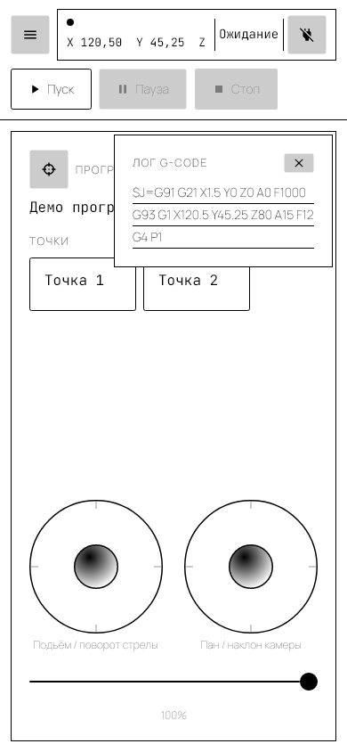

Окно **▤ «ЛОГ G-CODE»** из бокового меню показывает команды, **отправленные** приложением на контроллер, в порядке отправки:

- `$J=G91 G21 X… Y… Z… A… F…` — шаг ручного управления джойстиком; здесь `F` — обычная подача;
- `G93 G1 X… Y… Z… A… F…` — перемещение к точке (в программе и по команде «На точку»). `G93` — режим «обратного времени»: `F` в такой строке не скорость, а величина 60 ÷ время перехода в секундах. Например, `F12` означает переход за 5 секунд, `F6` — за 10;
- `G4 P…` — пауза («Стоянка») в точке.

Журнал нужен для диагностики: если станок поехал не туда, по нему видно, какие именно команды он получил. Хранятся последние 200 строк, более старые вытесняются. Окно не блокирует главный экран — можно управлять станком и одновременно смотреть журнал. Закрывается кнопкой **✕**.

Чего в журнале **нет**:

- ответов контроллера, включая `ok` и статусные отчёты — журнал односторонний;
- мгновенных команд, передаваемых одним байтом: запрос статуса, пауза (feed hold), продолжение и отмена джога. Поэтому нажатия «Пауза» и «Стоп» в журнале не отражаются;
- команды `$H` (homing) — приложение её не отправляет, homing выполняется со стороны станка.

Двусторонний обмен — вместе с ответами станка — виден в отчёте **ⓘ «О программе»**, раздел «Обмен с устройством» (см. [раздел 15](#15-о-программе-и-диагностика)). Там строк меньше, зато есть и то, что станок ответил.

---

## 14. Демонстрационный режим («Настройки мока»)

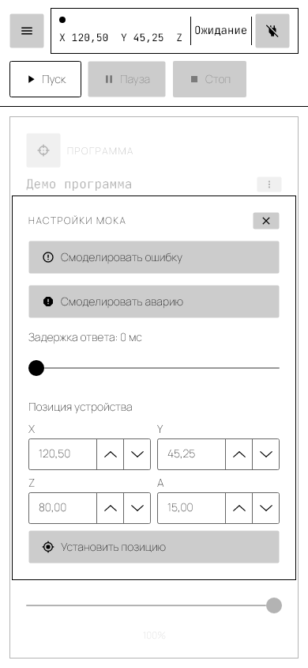

Режим **«Демо»** (см. [раздел 3](#3-подключение-к-устройству)) подменяет реальный станок симулятором: можно пройти весь сценарий работы — джойстики, захват точек, воспроизведение — без оборудования.

Окно **⚗ «Настройки мока»** из бокового меню позволяет проверить, как приложение ведёт себя в нештатных ситуациях:

- **⚠ Смоделировать ошибку** — следующая отправленная команда завершится ошибкой.
- **⛔ Смоделировать аварию** — симулирует аварию FluidNC, откроется окно из [раздела 6](#6-аварийные-ситуации).
- **Задержка ответа** (ползунок 0–5000 мс, шаг 250 мс) — задержка ответа симулятора, имитирует медленную или нестабильную связь.
- **Позиция устройства** — поля X/Y/Z/A и кнопка **◈ «Установить позицию»** мгновенно переносят симулированный станок в указанные координаты. Поля заполняются текущей позой станка при каждом открытии окна. Удобно, чтобы проверить программу «издалека» — например, посмотреть, как отработает первый ход, если станок стоит далеко от первой точки, — не проезжая туда джойстиками.

Окно открывается в любом режиме подключения, но кнопки действуют только при подключении в режиме «Демо»: с реальным станком нажатия не дают никакого эффекта.

Закрывается кнопкой **✕**.

---

## 15. О программе и диагностика

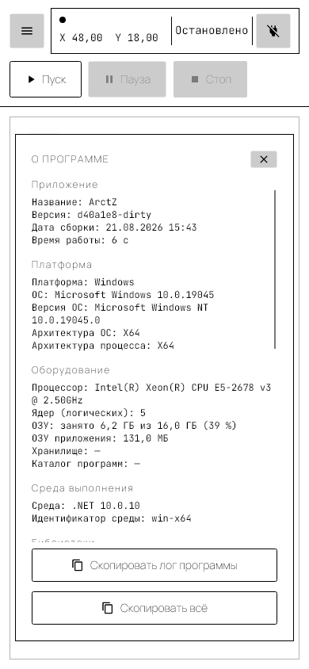

Пункт бокового меню **ⓘ «О программе»** открывает диагностический отчёт — то, что стоит приложить к сообщению о проблеме. Отчёт собирается в момент открытия окна и состоит из разделов:

| Раздел | Что внутри |
|---|---|
| Приложение | Название, версия (идентификатор сборки), дата сборки, время работы приложения |
| Платформа | Операционная система и её версия, разрядность системы и процесса |
| Оборудование | Процессор, число логических ядер, занятая и общая оперативная память, память приложения, свободное место в хранилище и каталог программ |
| Среда выполнения | Версия .NET и идентификатор среды |
| Библиотеки | Версии ключевых библиотек, на которых собрано приложение |
| Подключение | Состояние связи, выбранное устройство и приветственная строка прошивки FluidNC — единственное место, где видна её версия |
| Программа | Название текущей программы, число точек, состояние воспроизведения, есть ли несохранённые изменения |
| Последние ошибки | Накопленные ошибки приложения и контроллера |
| Обмен с устройством | Последние строки обмена со станком; регулярные статусные опросы из него отфильтрованы, чтобы не забивать список |

Внизу окна — кнопки копирования в буфер обмена:

- **⧉ «Скопировать всё»** — весь отчёт целиком;
- **⧉ «Скопировать лог программы»** — журнал последнего запуска программы. Кнопка появляется, только если в этом сеансе программа уже запускалась хотя бы раз.

### Журнал выполнения программы

Журнал — это отдельный от отчёта список событий последнего запуска, каждое с отметкой времени и достигнутого прогресса. В него попадают:

- запуск программы и её завершение с причиной («Завершено», «Остановлено», «Ошибка»);
- начало и окончание движения к каждой точке;
- паузы и возобновления;
- превышение расчётного времени точки — то же событие, что зажигает **⚠** на плитке (см. [раздел 4](#4-главный-экран));
- пропуск точки, в которой станок уже стоит (см. [раздел 9](#9-настройки-завершения-программы));
- расхождение между тем, сколько команд принял контроллер, и тем, где станок находится физически — признак того, что буфер контроллера ушёл вперёд реального движения.

Журнал живёт только в памяти и только до следующего запуска программы: он не сохраняется на диск и не переживает перезапуск приложения. Если разбираете проблему — копируйте журнал сразу после проблемного прогона, не запуская программу заново.

Окно закрывается кнопкой **✕**.

---

## 16. Где хранятся программы

Каждая программа — отдельный файл `.json`. Скопируйте эти файлы, чтобы сделать резервную копию или перенести программы на другое устройство; удалите файл, чтобы убрать программу из библиотеки (в самом приложении удаления нет).

| Платформа | Расположение |
|---|---|
| Desktop (Windows) | `%APPDATA%\ArctZ\Programs\` |
| Android | `<каталог данных приложения>/ArctZ/Programs/` |
| iOS | `Documents/ArctZ/Programs/` |
| Браузер | не сохраняются — программы живут только до перезагрузки страницы |

Приложение читает каталог при каждом открытии библиотеки, так что добавленные вручную файлы появятся в списке без перезапуска.

---

## 17. Устранение неполадок

| Симптом | Причина | Что делать |
|---|---|---|
| Не подключается к реальному устройству | Станок выключен, вне зоны действия или занят другим подключением. Причина ошибки в интерфейсе не показывается | Проверьте питание и Bluetooth-модуль станка, доступность виртуального COM-порта (SPP) в системе, отсутствие других подключений к станку. Для проверки приложения — режим «Демо» |
| Пункт «Устройство» не работает на iPhone/iPad | Bluetooth SPP на iOS недоступен на уровне системы | Работайте в режиме «Демо» либо с Desktop-, Android- или браузерной сборки |
| В браузере пункт «Устройство» отмечен как недоступный | Браузер не поддерживает Web Serial API | Откройте приложение в Chrome или Edge |
| Кнопка **◎** «Захватить» неактивна | Положение станка неизвестно: нет подключения или контроллер ещё не прислал статус | Дождитесь подключения и появления координат в шапке |
| **▶** «Пуск» нажимается, но ничего не происходит | В программе нет ни одной точки | Захватите хотя бы одну точку кнопкой **◎** |
| Первый ход программы получился слишком быстрым или, наоборот, затянулся | Путь из текущего положения в первую точку проходится за время перехода, заданное **в первой точке**, независимо от длины этого пути | Увеличьте «Время перехода» первой точки или подведите станок ближе к ней перед запуском (см. [раздел 8](#8-запуск-программы)) |
| На плитке точки загорелся **⚠** | Переход в эту точку занял больше заданного времени более чем на 15 % | Увеличьте «Время перехода» этой точки. Подробности — в меню плитки → **✉** «Сообщения» (см. [раздел 7](#7-ключевые-точки)) |
| Полоса прогресса дошла до конца, а станок ещё едет | Прогресс считается по времени: станок не уложился в заданные времена переходов | Ничего страшного, программа доедет. Чтобы полоса шла точнее, увеличьте времена переходов до реально достижимых |
| Кнопки «Скопировать лог программы» нет в окне «О программе» | В этом сеансе программа ещё ни разу не запускалась | Запустите программу — после этого кнопка появится (см. [раздел 15](#15-о-программе-и-диагностика)) |
| Программа сама встала на паузу | Началось переподключение — связь со станком прервалась | Дождитесь восстановления связи и нажмите «Пуск». Если связь потеряна окончательно, статус сменится на «Ошибка» |
| Появилось «Ошибка на сегменте N из M» | Команда отклонена контроллером или потеряна связь | Устраните причину и нажмите «Пуск» — программа начнётся заново с первой точки |
| Окно «АВАРИЯ» открывается снова после **↺** «Сброс аварии» | Контроллер не принял сброс: причина аварии не устранена или нужен homing на станке | Устраните физическую причину (концевик, препятствие), выполните homing на станке, проверьте стабильность связи |
| Джойстики не реагируют | Панель заблокирована на время выполнения программы (статус «Выполнение» или «Пауза») | Нажмите «Стоп» или дождитесь завершения программы |
| Пропали правки после смены программы | «Новая» и загрузка из библиотеки не спрашивают о несохранённых изменениях | Сохраняйте программу (⋮ → **▣** «Сохранить») перед такими действиями |
| Статус «Удержание» после «Стоп» | Станок остаётся в feed hold до следующего запуска | Это нормально; удержание снимется при нажатии **▶** «Пуск» |
| Статус «Завершено»/«Остановлено» сменился на «Ожидание» сам | Терминальные статусы сбрасываются через 4 секунды | Ничего делать не нужно |
| Программы пропали после перезагрузки браузера | В браузерной сборке программы хранятся только в памяти | Используйте Desktop-сборку, если программы нужно сохранять |
| Нужно понять, какие команды ушли на станок | — | Откройте **▤** «Лог G-code» из бокового меню (см. [раздел 13](#13-журнал-g-code)) |

---

## 18. Глоссарий

| Термин | Значение |
|---|---|
| **G-code** | Язык команд станка. На нём приложение разговаривает с контроллером |
| **FluidNC** | Прошивка контроллера, управляющего моторами джиба |
| **SPP** | Профиль Bluetooth, эмулирующий последовательный порт (виртуальный COM-порт). По нему идёт связь с реальным станком |
| **Ключевая точка** | Сохранённое положение стрелы и камеры (X/Y/Z/A) плюс время перехода в него и пауза после прихода |
| **Сегмент** | Перемещение к очередной точке. Программа из N точек состоит из N сегментов: первый ведёт в первую точку из текущего положения станка. Возврат в начальную позицию, если он включён, добавляет ещё один |
| **Время перехода** | Сколько секунд занимает движение в точку. Задаётся вместо скорости: станок сам подбирает скорость под расстояние |
| **G93 (обратное время)** | Режим G-code, в котором `F` задаёт не скорость, а величину 60 ÷ длительность движения в секундах. Так приложение передаёт станку время перехода |
| **Стоянка** | Пауза в секундах после прихода в точку, перед следующим перемещением |
| **Джог (jog)** | Ручное перемещение станка «по нажатию» — то, что делают джойстики |
| **Homing** | Поиск нулевых положений осей по концевым выключателям. В ArctZ не запускается, выполняется со стороны станка |
| **Feed hold** | Плавная остановка станка с сохранением позиции и очереди команд. Так работают «Пауза» и «Стоп» |
| **Alarm (авария)** | Состояние контроллера, при котором движение запрещено до явного сброса |
