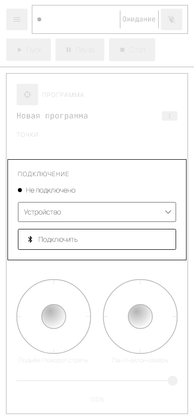
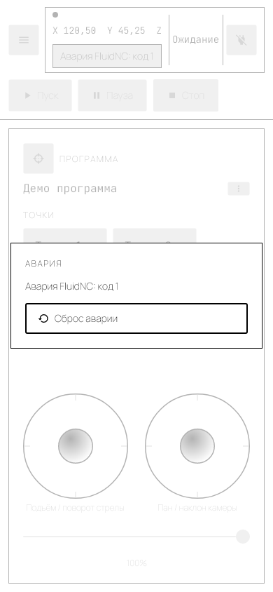
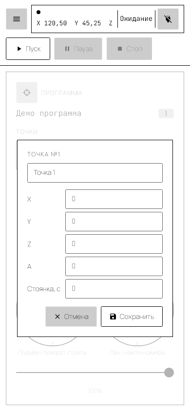
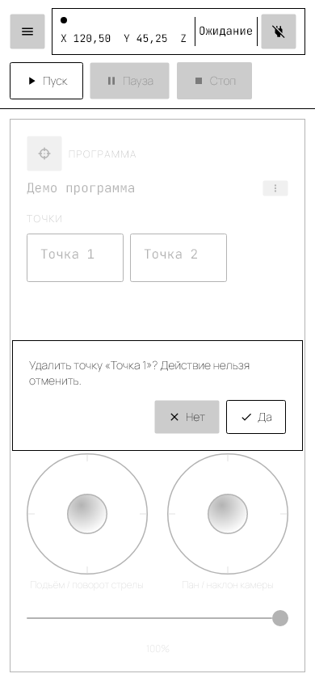
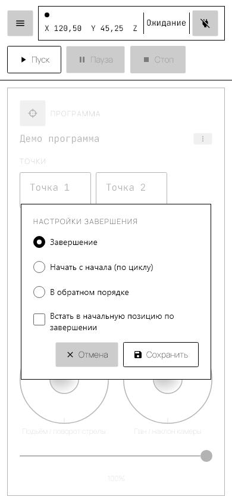
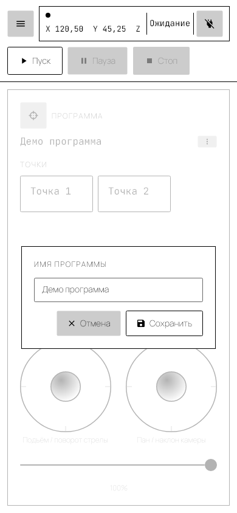
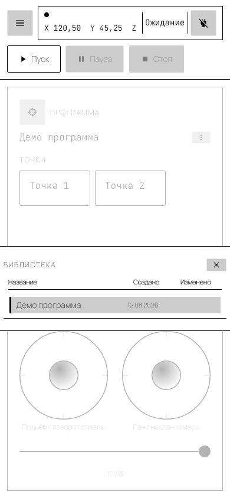
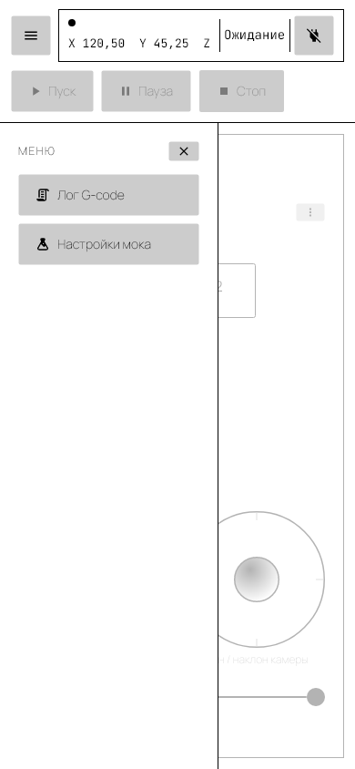
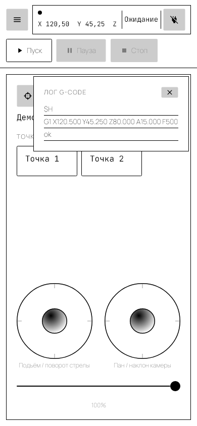
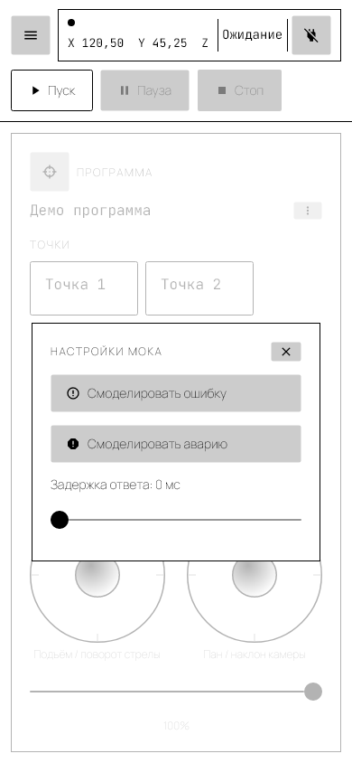

# Руководство пользователя ArctZ

<!-- Служебное (не для читателя руководства):
     скриншоты лежат в screenshots/ и перегенерируются командой
     dotnet test ArctZ.Tests.Screenshots/ArctZ.Tests.Screenshots.csproj
     При изменении интерфейса обновляйте и скриншоты, и этот документ.
     Экспорт в PDF: docs/export-user-guide-pdf.ps1 -->

**Документ соответствует состоянию приложения на 11.08.2026 (ветка `master`).** Скриншоты сняты с Desktop-сборки в печатной теме; на экране цвета темнее, расположение элементов то же.

ArctZ — приложение для управления камерным джибом: моторизованной стрелой для плавных операторских проездов и панорамирования. Приложение соединяется с контроллером FluidNC по Bluetooth и передаёт ему команды G-code.

Что вы можете делать:

- вручную водить стрелой и камерой двумя виртуальными джойстиками;
- записывать последовательность ключевых точек и сохранять её как программу;
- воспроизводить программу — один раз, по кругу или «туда-обратно»;
- следить за состоянием станка и разбирать проблемы связи по журналу отправленных команд.

## Что работает на какой платформе

Экраны на всех платформах выглядят одинаково, но возможности отличаются:

| Платформа | Реальный джиб по Bluetooth | Режим «Демо» | Сохранение программ |
|---|---|---|---|
| Desktop (Windows) | да | да | файлы на диске |
| Android | **нет** | да | файлы на диске |
| iOS | **нет** | да | файлы на диске |
| Браузер | **нет** | да | **только в памяти** — программы пропадают при перезагрузке страницы |

На Android, iOS и в браузере пункт «Устройство» в окне подключения присутствует, но подключение не выполнится: транспорт для реального Bluetooth там пока не реализован. Работайте в режиме «Демо» либо с Desktop-сборки. Подробнее о причинах — [`docs/protocol/bluetooth-gcode-control.md`](protocol/bluetooth-gcode-control.md).

## Содержание

1. [Быстрый старт](#1-быстрый-старт)
2. [Безопасность](#2-безопасность)
3. [Подключение к устройству](#3-подключение-к-устройству)
4. [Главный экран](#4-главный-экран)
5. [Ручное управление и оси станка](#5-ручное-управление-и-оси-станка)
6. [Аварийные ситуации](#6-аварийные-ситуации)
7. [Ключевые точки](#7-ключевые-точки)
8. [Запуск программы](#8-запуск-программы)
9. [Настройки завершения программы](#9-настройки-завершения-программы)
10. [Переименование, сохранение и создание новой программы](#10-переименование-сохранение-и-создание-новой-программы)
11. [Библиотека программ](#11-библиотека-программ)
12. [Боковое меню и навигация](#12-боковое-меню-и-навигация)
13. [Журнал G-code](#13-журнал-g-code)
14. [Демонстрационный режим («Настройки мока»)](#14-демонстрационный-режим-настройки-мока)
15. [Где хранятся программы](#15-где-хранятся-программы)
16. [Устранение неполадок](#16-устранение-неполадок)
17. [Глоссарий](#17-глоссарий)

---

## 1. Быстрый старт

Первый проезд можно записать за несколько минут — в том числе без станка, в режиме «Демо».

1. Запустите приложение. Откроется окно **«ПОДКЛЮЧЕНИЕ»**.
2. Выберите в списке **«Демо»** (для реального джиба — «Устройство») и нажмите **«Подключить»**. Дождитесь статуса «Подключено» — окно закроется само.
3. Джойстиками внизу экрана приведите стрелу и камеру в первое нужное положение.
4. Нажмите кнопку-прицел **◎ «Захватить»** — в списке «ТОЧКИ» появится «Точка 1».
5. Повторите шаги 3–4 ещё как минимум один раз: **программе нужно не меньше двух точек**, иначе воспроизводить будет нечего.
6. Откройте меню **⋮** рядом с названием программы → **▣ «Сохранить»**, введите имя и подтвердите.
7. Верните станок в первую точку: нажмите на плитку «Точка 1» → **⌖ «На точку»**. Это важно — воспроизведение начинается с перемещения **из текущего положения во вторую точку**, к первой станок сам не поедет (см. [раздел 8](#8-запуск-программы)).
8. Нажмите **▶ «Пуск»**. Плитка выполняемой точки подсвечивается рамкой; по окончании статус в шапке покажет «Завершено».

---

## 2. Безопасность

Приложение управляет механикой, которая двигается сама и с закреплённой на ней камерой. Перед каждым запуском программы:

- убедитесь, что в зоне движения стрелы нет людей, техники и препятствий, и не находитесь в ней сами во время воспроизведения;
- проверьте, что кабели камеры и питания имеют запас длины на всём пути движения и ни за что не зацепятся;
- проверьте балансировку и надёжность крепления камеры — программа выполняется на заданной скорости независимо от нагрузки;
- держите под рукой кнопку **⏹ «Стоп»**: она немедленно останавливает станок (feed hold). Если этого недостаточно — обесточьте станок.

Помните, что при разрыве связи станок останавливается не мгновенно: контроллер FluidNC успевает отработать уже принятые в буфер команды.

---

## 3. Подключение к устройству

При запуске приложение показывает модальное окно **«ПОДКЛЮЧЕНИЕ»**. Оно перекрывает главный экран, пока связь не установлена.

1. Выберите в раскрывающемся списке режим подключения:
   - **Устройство** — реальный джиб по Bluetooth (виртуальный COM-порт, профиль SPP). Работает только в Desktop-сборке.
   - **Демо** — симулятор станка, реального оборудования не требует. Подходит и для знакомства с приложением, и для проверки программ (см. [раздел 14](#14-демонстрационный-режим-настройки-мока)).
2. Нажмите **⊘ «Подключить»**.
3. Кружок-индикатор и текст рядом показывают ход подключения: «Не подключено» → «Подключение…» → «Подключено».
4. После успешного подключения окно закрывается автоматически, открывается главный экран.

**Если связь пропала во время работы**, приложение пытается переподключиться самостоятельно — в этот момент отображается статус «Переподключение…», а окно подключения появляется снова и блокирует главный экран, пока связь не восстановится.

Отключиться можно в любой момент кнопкой **⊘ питания** в шапке главного экрана (см. [раздел 4](#4-главный-экран)); во время воспроизведения программы она недоступна. После отключения снова открывается окно подключения.

Если станок на момент подключения уже находится в аварии (Alarm), сразу после закрытия окна подключения откроется окно аварии — см. [раздел 6](#6-аварийные-ситуации).

> **Известное ограничение.** Если подключение не удалось, окно просто остаётся в состоянии «Не подключено»: причина ошибки в интерфейсе не показывается. Проверьте питание и доступность станка, а на мобильных платформах и в браузере — используйте режим «Демо» (реальный Bluetooth там не поддерживается).

---

## 4. Главный экран

Главный экран состоит из шапки и панели программы.

### Шапка

- **☰** слева — открывает [боковое меню](#12-боковое-меню-и-навигация).
- **Строка статуса** показывает:
  - индикатор соединения и текущие координаты станка (X/Y/Z/A) — координаты появляются только после подключения, до этого стоит прочерк;
  - общий статус станка и программы одним словом;
  - кнопку **⊘** с подсказкой «Отключить» — разрывает соединение (недоступна во время воспроизведения).
- **▶ Пуск / ⏸ Пауза / ⏹ Стоп** — управление воспроизведением, см. [раздел 8](#8-запуск-программы).

Статус в шапке — единый для станка и программы; при совпадении нескольких условий побеждает верхнее в таблице:

| Статус | Что означает |
|---|---|
| **АВАРИЯ** | Контроллер сообщил об аварии. См. [раздел 6](#6-аварийные-ситуации) |
| **Ошибка** | Программа прервана ошибкой. Под списком точек появится сообщение с номером сегмента |
| **Выполнение** | Программа выполняется — либо станок физически ещё движется |
| **Пауза** | Программа приостановлена (кнопкой **⏸** «Пауза» или автоматически из-за потери связи) |
| **Джог** | Станок движется по команде джойстика |
| **Homing** | Станок выполняет поиск нулевых положений (запускается со стороны станка) |
| **Завершено** | Программа отработала до конца |
| **Остановлено** | Программа прервана кнопкой «Стоп» |
| **Удержание** | Станок удерживается в feed hold — обычное состояние после «Стоп» до следующего «Пуск» |
| **Ожидание** | Станок свободен, программа не выполняется |

Статусы «Завершено», «Остановлено» и «Ошибка» через 4 секунды сами сменяются на «Ожидание» — это нормально, ничего не зависло.

### Панель «ПРОГРАММА»

- Кнопка-прицел **◎ «Захватить»** — добавляет ключевую точку с текущим положением станка. Доступна только когда положение известно (станок подключён и прислал статус).
- Название программы и кнопка **⋮** рядом с ним. В меню: **✎ «Переименовать»**, **▭ «Новая»**, **▣ «Сохранить»**, **⚑ «Настройки завершения»**, **▥ «Библиотека»**.
- Список **«ТОЧКИ»** — плитки в порядке выполнения. Нажатие на плитку открывает меню действий над точкой (см. [раздел 7](#7-ключевые-точки)). Плитка точки, к которой станок едет прямо сейчас, обведена акцентной рамкой.
- Два виртуальных джойстика внизу — см. [раздел 5](#5-ручное-управление-и-оси-станка).

Во время воспроизведения (статус «Выполнение» или «Пауза») вся панель «ПРОГРАММА» заблокирована: ни захватить точку, ни отредактировать её, ни подвигать джойстиками нельзя. Нажмите «Стоп» или дождитесь завершения программы.

---

## 5. Ручное управление и оси станка

Джойстики работают, пока программа не выполняется. Чем дальше отклонён джойстик, тем выше скорость: приложение шлёт станку команды пошагового перемещения (`$J=`), а сила отклонения задаёт подачу.

| Джойстик | Направление | Ось | Что двигается |
|---|---|---|---|
| Левый | горизонталь | **X** | подъём стрелы |
| Левый | вертикаль | **Y** | поворот стрелы |
| Правый | горизонталь | **Z** | пан камеры |
| Правый | вертикаль | **A** | наклон камеры |

Эти же обозначения X/Y/Z/A вы видите в координатах в шапке и в полях редактора точки.

**Пределы движения.** Приложение ограничивает ручное управление: X — диапазоном от −15 до 65, Z и A замкнуты по кругу (360 переходит в 0), Y не ограничен. Пределы зашиты в приложении и в этой версии не настраиваются. Обратите внимание: на значения, введённые **вручную** в редакторе точки, эти ограничения не распространяются — такая координата уйдёт на станок как есть.

**Единицы измерения** приложение не преобразует: числа в полях X/Y/Z/A — те же, что показывает контроллер FluidNC согласно его собственной конфигурации (см. [`docs/firmware/fluidnc-setup.md`](firmware/fluidnc-setup.md)).

---

## 6. Аварийные ситуации

Когда контроллер FluidNC сообщает об аварии (Alarm — например, сработал концевой выключатель или потеряна позиция), приложение показывает блокирующее окно **«АВАРИЯ»** с кодом ошибки (например, «Авария FluidNC: код 1»).

1. Устраните физическую причину аварии на станке: упор в концевой выключатель, препятствие на пути движения и т. п.
2. Нажмите **↺ «Сброс аварии»**.
3. Если контроллер принял сброс, окно закрывается и станок возвращается в рабочее состояние.

Пока окно аварии открыто, главный экран недоступен.

Если одновременно потеряна связь, приоритет у окна подключения (см. [раздел 3](#3-подключение-к-устройству)): без связи сброс аварии всё равно не выполнится. После восстановления связи окно аварии откроется снова, если авария ещё активна.

---

## 7. Ключевые точки

Ключевая точка — это положение стрелы и камеры (координаты X/Y/Z/A) плюс пауза после прихода в него. Точки выполняются в том порядке, в каком лежат в списке; номера пересчитываются автоматически при удалении и перемещении.

### Добавление точки

Приведите станок в нужное положение и нажмите кнопку-прицел **◎ «Захватить»**. В конец списка добавится точка с именем «Точка N» и текущими координатами станка. Редактор при этом не открывается — чтобы переименовать точку или поправить координаты, откройте её вручную (см. ниже).

Кнопка неактивна, пока положение станка неизвестно: нет подключения либо контроллер ещё не прислал ни одного статуса.

### Меню точки

Нажатие на плитку открывает меню:

- **⌖ На точку** — отправляет станок прямо в координаты этой точки. Удобно, чтобы проверить точку и чтобы встать в первую точку перед запуском. Требует подключения.
- **✎ Изменить** — открывает редактор точки.
- **⤓ Из машины** — заменяет координаты точки текущим положением станка (имя и пауза сохраняются).
- **⬆ Переместить вверх / ⬇ Переместить вниз** — меняет порядок выполнения.
- **␡ Удалить** — удаляет точку после подтверждения.

### Редактор точки

Окно **«ТОЧКА №N»** содержит:

| Поле | Назначение |
|---|---|
| Название (поле вверху, не более 30 символов) | Подпись на плитке. Длинные названия отображаются шрифтом меньшего размера |
| X, Y, Z, A | Координаты осей (расшифровка осей — в [разделе 5](#5-ручное-управление-и-оси-станка)) |
| Стоянка, с | Пауза в секундах после прихода в точку, перед перемещением к следующей. 0 — без паузы |

**▣ «Сохранить»** применяет изменения (к программе, не к файлу на диске), **✕ «Отмена»** закрывает окно без изменений.

> **Скорость перемещения в этой версии не настраивается.** У каждой точки есть скорость подхода, но в интерфейсе её нет: при захвате точке присваивается фиксированное значение 500 единиц/мин. Плавный разгон и торможение, а также слитные переходы без остановки в точке в интерфейсе тоже пока не настраиваются.

### Удаление точки

Удаление всегда подтверждается: «Удалить точку «…»? Действие нельзя отменить.» — **✔ «Да»** удаляет, **✕ «Нет»** отменяет.

Редактирование точек и кнопка **◎ «Захватить»** недоступны во время воспроизведения программы.

---

## 8. Запуск программы

Воспроизведением управляют три кнопки в шапке.

- **▶ Пуск** — запускает программу или продолжает её после паузы. Если программа ещё не сохранена или в ней есть несохранённые изменения, сначала появится запрос на сохранение (см. [раздел 10](#10-переименование-сохранение-и-создание-новой-программы)).
- **⏸ Пауза** — доступна только во время выполнения. Останавливает станок (feed hold); продолжить можно кнопкой «Пуск».
- **⏹ Стоп** — доступна во время выполнения и на паузе. Прерывает программу. Станок остаётся удерживаемым (статус «Удержание») до следующего «Пуск».

### С какой точки начинается движение

Программа состоит из **перемещений между соседними точками**: 1→2, 2→3 и так далее. Отдельного перемещения «в первую точку» в начале нет, поэтому после нажатия «Пуск» станок поедет из того положения, в котором находится, сразу **во вторую точку**.

Поэтому перед запуском приведите станок в первую точку — через меню плитки «Точка 1» → **⌖ «На точку»**.

По той же причине программа из одной точки не содержит ни одного перемещения: «Пуск» ничего не сделает.

### Если программа прервалась ошибкой

Под списком точек появляется предупреждение вида «Ошибка на сегменте 3 из 7. «Пуск» запустит программу заново с начала», а статус в шапке меняется на «Ошибка». Обратите внимание: после ошибки «Пуск» **не продолжает** программу с места сбоя, а перезапускает её целиком.

### Если пропала связь во время выполнения

- Начало переподключения → программа автоматически переходит в **«Пауза»**.
- Связь окончательно потеряна → статус **«Ошибка»**, программа прервана.
- После восстановления связи программа остаётся на паузе: продолжение — только вашим явным нажатием «Пуск».

---

## 9. Настройки завершения программы

Эти настройки определяют, что станок делает, пройдя все точки. Открываются через меню **⋮** → **⚑ «Настройки завершения»**.

- **Завершение** — программа останавливается после одного прохода.
- **Начать с начала (по циклу)** — станок возвращается в первую точку и повторяет программу.
- **В обратном порядке** — станок идёт по точкам вперёд, затем назад, и так далее (маятник).

Для режимов «Начать с начала» и «В обратном порядке» доступен параметр:

- **Количество повторов** — сколько циклов выполнить. Для маятникового режима один цикл — это пара «туда и обратно». Поле неактивно, если включено **«Неограниченно»**.

Разница между циклическими режимами: в режиме «Начать с начала» между циклами станок отдельно доезжает до первой точки, в маятниковом режиме такого перемещения нет — обратный проход начинается с той точки, где закончился прямой.

Независимо от режима можно включить **«Встать в начальную позицию по завершении»** — тогда после последнего прохода станок дополнительно вернётся в первую точку.

**▣ «Сохранить»** применяет настройки к программе, **✕ «Отмена»** закрывает окно без изменений. Чтобы сохранить их на диск, воспользуйтесь ⋮ → **▣ «Сохранить»**.

---

## 10. Переименование, сохранение и создание новой программы

> **Важно про потерю данных.** Приложение **не** спрашивает о несохранённых изменениях, когда вы создаёте новую программу (⋮ → **▭ «Новая»**) или загружаете программу из библиотеки. В обоих случаях текущая программа со всеми правками заменяется немедленно. Сохраняйте программу до таких действий.

Меню **⋮** рядом с названием программы:

- **✎ Переименовать** — открывает окно **«ИМЯ ПРОГРАММЫ»** с текущим именем. Введите новое и нажмите **▣ «Сохранить»** (или **✕ «Отмена»**, чтобы оставить прежнее). Переименование меняет имя только в текущей программе; чтобы записать его на диск, выполните «Сохранить».
- **▭ Новая** — очищает экран: имя сбрасывается на «Новая программа», точки и настройки завершения удаляются. Без предупреждения — см. врезку выше.
- **▣ Сохранить** — записывает программу в библиотеку:
  - при первом сохранении сначала запрашивается имя (тем же окном «ИМЯ ПРОГРАММЫ»);
  - если программа уже сохранялась, запрашивается подтверждение перезаписи: «Сохранить поверх ранее сохранённой программы «…»? Текущие данные на диске будут перезаписаны.»;
  - если в библиотеке уже есть **другая** программа с таким же именем, приложение отдельно предупредит об этом и предложит всё-таки сохранить дубликат под тем же именем.

Сохранение может начаться и само — при нажатии **▶ «Пуск»**: если программа ещё не сохранялась, будет запрошено имя; если есть несохранённые изменения, появится вопрос «В программе «…» есть несохранённые изменения. Сохранить перед запуском?». В обоих случаях можно ответить **✕ «Нет»** — тогда программа не запустится.

---

## 11. Библиотека программ

В библиотеке лежат все сохранённые программы. Открывается через меню **⋮** → **▥ «Библиотека»**.

- В списке видны имя программы, дата создания и дата изменения. Колонка «Изменено» заполняется, только если программа изменялась не в день создания.
- Текущая загруженная программа отмечена цветной полосой слева.
- Нажатие на строку загружает программу — она заменяет текущую на экране (**без** предупреждения о несохранённых изменениях, см. [раздел 10](#10-переименование-сохранение-и-создание-новой-программы)).
- Закрывается кнопка **✕**.

Особенности этой версии: порядок программ в списке не сортируется (как файлы лежат на диске), поиска нет, **удалить программу из библиотеки в приложении нельзя** — удаляйте файл вручную (см. [раздел 15](#15-где-хранятся-программы)).

---

## 12. Боковое меню и навигация

Кнопка **☰** в левом верхнем углу открывает панель **«МЕНЮ»** с двумя пунктами:

- **▤ Лог G-code** — см. [раздел 13](#13-журнал-g-code).
- **⚗ Настройки мока** — см. [раздел 14](#14-демонстрационный-режим-настройки-мока).

Меню закрывается кнопкой **✕** или выбором любого из пунктов. Нажатие на затемнённую область экрана меню не закрывает — это относится и ко всем остальным окнам приложения: каждое закрывается только своей кнопкой.

---

## 13. Журнал G-code

Окно **▤ «ЛОГ G-CODE»** из бокового меню показывает команды, **отправленные** приложением на контроллер, в порядке отправки:

- `$J=G91 G21 X… Y… Z… A… F…` — шаг ручного управления джойстиком;
- `G1 X… Y… Z… A… F…` — перемещение к точке (в программе и по команде «На точку»);
- `G4 P…` — пауза («Стоянка») в точке.

Журнал нужен для диагностики: если станок поехал не туда, по нему видно, какие именно команды он получил. Хранятся последние 200 строк, более старые вытесняются. Окно не блокирует главный экран — можно управлять станком и одновременно смотреть журнал. Закрывается кнопкой **✕**.

Чего в журнале **нет**:

- ответов контроллера, включая `ok` и статусные отчёты — журнал односторонний;
- мгновенных команд, передаваемых одним байтом: запрос статуса, пауза (feed hold), продолжение и отмена джога. Поэтому нажатия «Пауза» и «Стоп» в журнале не отражаются;
- команды `$H` (homing) — приложение её не отправляет, homing выполняется со стороны станка.

---

## 14. Демонстрационный режим («Настройки мока»)

Режим **«Демо»** (см. [раздел 3](#3-подключение-к-устройству)) подменяет реальный станок симулятором: можно пройти весь сценарий работы — джойстики, захват точек, воспроизведение — без оборудования.

Окно **⚗ «Настройки мока»** из бокового меню позволяет проверить, как приложение ведёт себя в нештатных ситуациях:

- **⚠ Смоделировать ошибку** — следующая отправленная команда завершится ошибкой.
- **⛔ Смоделировать аварию** — симулирует аварию FluidNC, откроется окно из [раздела 6](#6-аварийные-ситуации).
- **Задержка ответа** (ползунок 0–5000 мс, шаг 250 мс) — задержка ответа симулятора, имитирует медленную или нестабильную связь.

Окно открывается в любом режиме подключения, но кнопки действуют только при подключении в режиме «Демо»: с реальным станком нажатия не дают никакого эффекта.

Закрывается кнопкой **✕**.

---

## 15. Где хранятся программы

Каждая программа — отдельный файл `.json`. Скопируйте эти файлы, чтобы сделать резервную копию или перенести программы на другое устройство; удалите файл, чтобы убрать программу из библиотеки (в самом приложении удаления нет).

| Платформа | Расположение |
|---|---|
| Desktop (Windows) | `%APPDATA%\ArctZ\Programs\` |
| Android | `<каталог данных приложения>/ArctZ/Programs/` |
| iOS | `Documents/ArctZ/Programs/` |
| Браузер | не сохраняются — программы живут только до перезагрузки страницы |

Приложение читает каталог при каждом открытии библиотеки, так что добавленные вручную файлы появятся в списке без перезапуска.

---

## 16. Устранение неполадок

| Симптом | Причина | Что делать |
|---|---|---|
| Не подключается к реальному устройству | Станок выключен, вне зоны действия или занят другим подключением. Причина ошибки в интерфейсе не показывается | Проверьте питание и Bluetooth-модуль станка, доступность виртуального COM-порта (SPP) в системе, отсутствие других подключений к станку. Для проверки приложения — режим «Демо» |
| Пункт «Устройство» не работает на телефоне или в браузере | Реальный Bluetooth поддержан только в Desktop-сборке | Работайте в режиме «Демо» либо с Desktop-сборки |
| Кнопка **◎** «Захватить» неактивна | Положение станка неизвестно: нет подключения или контроллер ещё не прислал статус | Дождитесь подключения и появления координат в шапке |
| **▶** «Пуск» нажимается, но ничего не происходит | В программе меньше двух точек — перемещать станок некуда | Добавьте ещё хотя бы одну точку |
| В начале программы станок поехал не в первую точку | Программа состоит из перемещений между точками; движения «в первую точку» в ней нет | Перед запуском выполните **⌖** «На точку» для первой точки (см. [раздел 8](#8-запуск-программы)) |
| Программа сама встала на паузу | Началось переподключение — связь со станком прервалась | Дождитесь восстановления связи и нажмите «Пуск». Если связь потеряна окончательно, статус сменится на «Ошибка» |
| Появилось «Ошибка на сегменте N из M» | Команда отклонена контроллером или потеряна связь | Устраните причину и нажмите «Пуск» — программа начнётся заново с первой точки |
| Окно «АВАРИЯ» открывается снова после **↺** «Сброс аварии» | Контроллер не принял сброс: причина аварии не устранена или нужен homing на станке | Устраните физическую причину (концевик, препятствие), выполните homing на станке, проверьте стабильность связи |
| Джойстики не реагируют | Панель заблокирована на время выполнения программы (статус «Выполнение» или «Пауза») | Нажмите «Стоп» или дождитесь завершения программы |
| Пропали правки после смены программы | «Новая» и загрузка из библиотеки не спрашивают о несохранённых изменениях | Сохраняйте программу (⋮ → **▣** «Сохранить») перед такими действиями |
| Статус «Удержание» после «Стоп» | Станок остаётся в feed hold до следующего запуска | Это нормально; удержание снимется при нажатии **▶** «Пуск» |
| Статус «Завершено»/«Остановлено» сменился на «Ожидание» сам | Терминальные статусы сбрасываются через 4 секунды | Ничего делать не нужно |
| Программы пропали после перезагрузки браузера | В браузерной сборке программы хранятся только в памяти | Используйте Desktop-сборку, если программы нужно сохранять |
| Нужно понять, какие команды ушли на станок | — | Откройте **▤** «Лог G-code» из бокового меню (см. [раздел 13](#13-журнал-g-code)) |

---

## 17. Глоссарий

| Термин | Значение |
|---|---|
| **G-code** | Язык команд станка. На нём приложение разговаривает с контроллером |
| **FluidNC** | Прошивка контроллера, управляющего моторами джиба |
| **SPP** | Профиль Bluetooth, эмулирующий последовательный порт (виртуальный COM-порт). По нему идёт связь с реальным станком |
| **Ключевая точка** | Сохранённое положение стрелы и камеры (X/Y/Z/A) плюс пауза после прихода в него |
| **Сегмент** | Перемещение между двумя соседними точками. Программа из N точек состоит из N−1 сегментов |
| **Стоянка** | Пауза в секундах после прихода в точку, перед следующим перемещением |
| **Джог (jog)** | Ручное перемещение станка «по нажатию» — то, что делают джойстики |
| **Homing** | Поиск нулевых положений осей по концевым выключателям. В ArctZ не запускается, выполняется со стороны станка |
| **Feed hold** | Плавная остановка станка с сохранением позиции и очереди команд. Так работают «Пауза» и «Стоп» |
| **Alarm (авария)** | Состояние контроллера, при котором движение запрещено до явного сброса |
